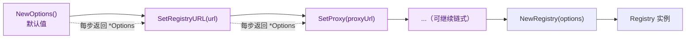
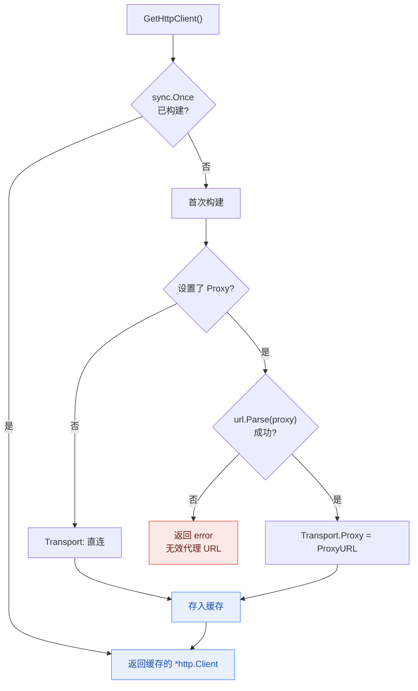

# 配置选项

NPM Skills 提供灵活的配置选项，允许您自定义注册表 URL、代理设置等。

## Options 结构

```go
type Options struct {
    RegistryURL string  // NPM 仓库服务器的 URL 地址
    Proxy       string  // HTTP 代理服务器的 URL
}
```

## 创建配置

### `NewOptions() *Options`

创建并返回一个新的默认配置选项实例。

**默认配置:**
- RegistryURL: "https://registry.npmjs.org"
- Proxy: 无代理设置

**示例:**
```go
options := registry.NewOptions()
fmt.Printf("默认注册表: %s\n", options.RegistryURL)
```

## 配置方法

### `SetRegistryURL(url string) *Options`

设置 NPM 仓库服务器的 URL 地址。

**参数:**
- `url` - NPM 仓库 URL 地址

**返回值:**
- `*Options` - 更新后的选项对象（支持链式调用）

**示例:**
```go
options := registry.NewOptions().
    SetRegistryURL("https://registry.npmmirror.com")
```

### `SetProxy(proxyUrl string) *Options`

设置 HTTP 代理服务器的 URL 地址。

**参数:**
- `proxyUrl` - HTTP 代理服务器的 URL 地址

**返回值:**
- `*Options` - 更新后的选项对象（支持链式调用）

**示例:**
```go
options := registry.NewOptions().
    SetProxy("http://proxy.corp.com:8080")
```

### 链式配置

支持链式调用，可以一次性配置多个选项：

```go
options := registry.NewOptions().
    SetRegistryURL("https://registry.npmmirror.com").
    SetProxy("http://proxy.corp.com:8080")

client := registry.NewRegistry(options)
```

每个 `SetXxx` 方法都返回 `*Options` 自身，从而串成流式构建管线，最后交给 `NewRegistry` 生成不可变客户端：



## HTTP 客户端

### `GetHttpClient() (*http.Client, error)`

根据当前选项配置创建并返回一个 HTTP 客户端。

**返回值:**
- `*http.Client` - 配置好的 HTTP 客户端
- `error` - 如果代理 URL 解析失败

**示例:**
```go
options := registry.NewOptions().
    SetProxy("http://proxy.example.com:8080")

httpClient, err := options.GetHttpClient()
if err != nil {
    log.Fatalf("创建 HTTP 客户端失败: %v", err)
}

// 使用自定义 HTTP 客户端
transport := httpClient.Transport
```

`GetHttpClient()` 内部借助 `sync.Once` 保证客户端只构建一次；是否配置代理决定了 `Transport` 的走向：



## 预定义配置

NPM Skills 提供了多种预定义的镜像源配置：

### 官方镜像

```go
// NPM 官方注册表
client := registry.NewRegistry()

// Yarn 官方镜像
client := registry.NewYarnRegistry()
```

### 中国镜像源

```go
// 淘宝 NPM 镜像
client := registry.NewTaoBaoRegistry()

// NPM Mirror
client := registry.NewNpmMirrorRegistry()

// 华为云镜像
client := registry.NewHuaWeiCloudRegistry()

// 腾讯云镜像
client := registry.NewTencentRegistry()

// CNPM 镜像
client := registry.NewCnpmRegistry()

// NPM CouchDB 镜像
client := registry.NewNpmjsComRegistry()
```

## 配置示例

### 基本配置

```go
// 使用淘宝镜像
options := registry.NewOptions().
    SetRegistryURL("https://registry.npmmirror.com")

client := registry.NewRegistry(options)
```

### 代理配置

```go
// 配置企业代理
options := registry.NewOptions().
    SetRegistryURL("https://registry.npmjs.org").
    SetProxy("http://proxy.company.com:8080")

client := registry.NewRegistry(options)
```

### 完整配置示例

```go
package main

import (
    "context"
    "fmt"
    "log"
    "time"

    "github.com/scagogogo/npm-skills/pkg/registry"
)

func main() {
    // 创建自定义配置
    options := registry.NewOptions().
        SetRegistryURL("https://registry.npmmirror.com").  // 使用国内镜像
        SetProxy("http://proxy.company.com:8080")          // 配置企业代理

    // 创建客户端
    client := registry.NewRegistry(options)
    
    // 设置超时
    ctx, cancel := context.WithTimeout(context.Background(), 30*time.Second)
    defer cancel()
    
    // 获取包信息
    pkg, err := client.GetPackageInformation(ctx, "react")
    if err != nil {
        log.Fatalf("获取包信息失败: %v", err)
    }
    
    fmt.Printf("包名: %s\n", pkg.Name)
    fmt.Printf("最新版本: %s\n", pkg.DistTags["latest"])
    
    // 获取当前配置
    currentOptions := client.GetOptions()
    fmt.Printf("当前注册表: %s\n", currentOptions.RegistryURL)
    fmt.Printf("当前代理: %s\n", currentOptions.Proxy)
}
```

## 环境变量支持

可以通过环境变量配置默认选项：

```bash
# 设置默认注册表
export NPM_REGISTRY_URL="https://registry.npmmirror.com"

# 设置代理
export HTTP_PROXY="http://proxy.company.com:8080"
export HTTPS_PROXY="http://proxy.company.com:8080"
```

## 最佳实践

### 选择合适的镜像源

```go
// 根据地理位置选择镜像源
var client *registry.Registry

switch region {
case "china":
    // 中国大陆用户推荐使用国内镜像
    client = registry.NewNpmMirrorRegistry()
case "global":
    // 其他地区使用官方镜像
    client = registry.NewRegistry()
default:
    // 默认使用官方镜像
    client = registry.NewRegistry()
}
```

### 企业环境配置

```go
// 企业环境通常需要代理配置
options := registry.NewOptions().
    SetRegistryURL("https://registry.npmjs.org").
    SetProxy(os.Getenv("CORPORATE_PROXY"))

if options.Proxy == "" {
    log.Println("警告: 未设置企业代理，可能无法访问外网")
}

client := registry.NewRegistry(options)
```

### 配置验证

```go
func validateOptions(options *registry.Options) error {
    // 验证注册表 URL 格式
    if _, err := url.Parse(options.RegistryURL); err != nil {
        return fmt.Errorf("无效的注册表 URL: %w", err)
    }
    
    // 验证代理 URL 格式（如果设置了代理）
    if options.Proxy != "" {
        if _, err := url.Parse(options.Proxy); err != nil {
            return fmt.Errorf("无效的代理 URL: %w", err)
        }
    }
    
    return nil
}

// 使用验证
options := registry.NewOptions().
    SetRegistryURL("https://registry.npmmirror.com").
    SetProxy("http://proxy.example.com:8080")

if err := validateOptions(options); err != nil {
    log.Fatalf("配置验证失败: %v", err)
}

client := registry.NewRegistry(options)
``` 