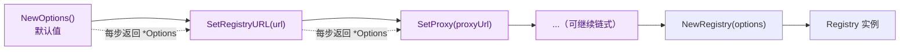
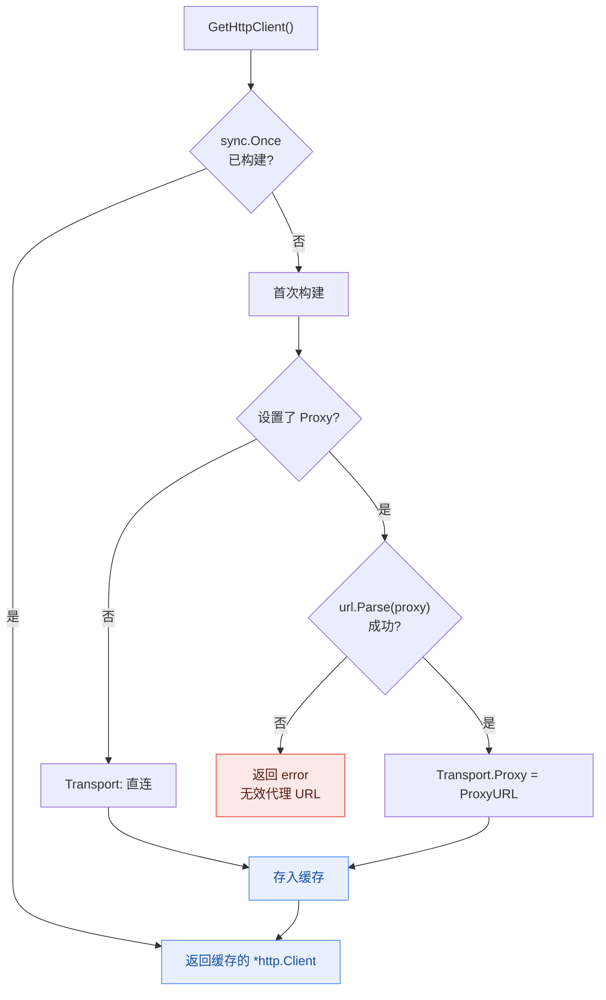

# 配置选项

NPM Skills 提供灵活的配置选项，允许您自定义注册表 URL、代理设置等。

## Options 结构

所有字段均为导出字段，但推荐通过链式的 `SetXxx` 方法设置：

```go
type Options struct {
    RegistryURL      string        // NPM 注册表服务器的 URL 地址
    Proxy            string        // HTTP/HTTPS 代理服务器的 URL
    Token            string        // Bearer 认证令牌
    Username         string        // Basic 认证用户名
    Password         string        // Basic 认证密码
    DownloadStatsURL string        // 下载统计 API 的基础 URL
    Timeout          time.Duration // 单次请求超时（0 表示不设截止时间）
    UserAgent        string        // 请求携带的 User-Agent 头
    InsecureSkipVerify bool        // 是否跳过 TLS 证书校验
}
```

底层 `*http.Client` **不是**直接设置的字段——它在首次调用 `GetHttpClient()` 时根据以上选项懒构建，并用 `sync.Once` 缓存。

## 创建配置

### `NewOptions() *Options`

创建并返回一个新的默认配置选项实例。

**默认配置:**
- RegistryURL: "https://registry.npmjs.org"
- UserAgent: "npm-skills-sdk"
- Proxy: 无代理设置
- Timeout: 0（不额外加超时；`>0` 时 SDK 自动给请求 context 套截止时间）

**示例:**
```go
options := registry.NewOptions()
fmt.Printf("默认注册表: %s\n", options.RegistryURL)
```

## 配置方法

### `SetRegistryURL(url string) *Options`

设置 NPM 注册表服务器的 URL 地址。

**参数:**
- `url` - NPM 注册表 URL 地址

**返回值:**
- `*Options` - 更新后的选项对象（支持链式调用）

**示例:**
```go
options := registry.NewOptions().
    SetRegistryURL("https://registry.npmmirror.com")
```

### `SetProxy(proxyUrl string) *Options`

设置 HTTP 代理服务器的 URL 地址。

**参数:**
- `proxyUrl` - HTTP 代理服务器的 URL 地址

**返回值:**
- `*Options` - 更新后的选项对象（支持链式调用）

**示例:**
```go
options := registry.NewOptions().
    SetProxy("http://proxy.corp.com:8080")
```

### `SetToken(token string) *Options`

设置 Bearer 认证令牌，以 `Authorization: Bearer <token>` 头发送。适用于使用 npm token 认证的私有注册表。

**参数:**
- `token` - 认证令牌

**示例:**
```go
options := registry.NewOptions().
    SetRegistryURL("https://npm.pkg.github.com").
    SetToken("ghp_xxxxxxxxxxxx")
```

### `SetBasicAuth(username, password string) *Options`

设置 HTTP Basic 认证的用户名与密码。

**参数:**
- `username` - Basic 认证用户名
- `password` - Basic 认证密码

**示例:**
```go
options := registry.NewOptions().
    SetRegistryURL("https://private-registry.example.com").
    SetBasicAuth("alice", "s3cret")
```

### `SetTimeout(timeout time.Duration) *Options`

设置 SDK 单次请求的超时。当 `Timeout > 0` 时，SDK 会在发起请求前自动用 `context.WithTimeout` 给传入的 context 套一层截止时间（即便调用方传入的是 `context.Background()` 也会生效）。默认值为 `0`，表示不额外加超时——此时超时完全由调用方传入的 context 决定。

::: tip 与 context 的关系
`SetTimeout` 与调用方自带的 context 超时**叠加生效**（取先到期的那个）。若你已用 `context.WithTimeout` 控制了每次调用的截止时间，则无需再设 `SetTimeout`；若你的代码多处复用同一个 `context.Background()` 又希望统一兜底超时，用 `SetTimeout` 更方便。
:::

**参数:**
- `timeout` - 请求超时时长

**示例:**
```go
options := registry.NewOptions().
    SetTimeout(30 * time.Second)
```

### `SetUserAgent(userAgent string) *Options`

设置请求携带的自定义 User-Agent 头。

**参数:**
- `userAgent` - User-Agent 字符串

**示例:**
```go
options := registry.NewOptions().
    SetUserAgent("MyApp/1.0 (contact@example.com)")
```

### `SetInsecureSkipVerify(skip bool) *Options`

控制是否跳过 TLS 证书校验。默认 `false`（开启校验）。仅在面向使用自签名证书的可信内部注册表时启用，切勿在公网生产环境中开启。

**参数:**
- `skip` - `true` 表示跳过 TLS 校验

**示例:**
```go
options := registry.NewOptions().
    SetRegistryURL("https://internal-registry.local").
    SetInsecureSkipVerify(true) // 内部主机的自签名证书
```

### `SetDownloadStatsURL(url string) *Options`

覆盖下载统计查询使用的基础 URL（默认 `https://api.npmjs.org`）。当镜像在不同主机上提供统计接口时有用。

**参数:**
- `url` - 下载统计 API 的基础 URL

**示例:**
```go
options := registry.NewOptions().
    SetDownloadStatsURL("https://api.npmjs.org")
```

### 链式配置

支持链式调用，可以一次性配置多个选项：

```go
options := registry.NewOptions().
    SetRegistryURL("https://registry.npmmirror.com").
    SetProxy("http://proxy.corp.com:8080")

client := registry.NewRegistry(options)
```

每个 `SetXxx` 方法都返回 `*Options` 自身，从而串成流式构建管线，最后交给 `NewRegistry` 生成不可变客户端：



## HTTP 客户端

### `GetHttpClient() (*http.Client, error)`

根据当前选项配置创建并返回一个 HTTP 客户端。

**返回值:**
- `*http.Client` - 配置好的 HTTP 客户端
- `error` - 如果代理 URL 解析失败

**示例:**
```go
options := registry.NewOptions().
    SetProxy("http://proxy.example.com:8080")

httpClient, err := options.GetHttpClient()
if err != nil {
    log.Fatalf("创建 HTTP 客户端失败: %v", err)
}

// 使用自定义 HTTP 客户端
transport := httpClient.Transport
```

`GetHttpClient()` 内部借助 `sync.Once` 保证客户端只构建一次；是否配置代理决定了 `Transport` 的走向：



::: tip 关于底层传输的精细控制
SDK 在内部构建 `http.Transport`，因此诸如 `MaxIdleConns`、自定义 `RoundTripper`、指定 TLS `MinVersion` 等设置**不会**作为选项暴露。可调项包括：代理（`SetProxy`）、单次请求超时（`SetTimeout`）、TLS 校验（`SetInsecureSkipVerify`）以及认证（`SetToken` / `SetBasicAuth`）。若需超出这些范围，请复用同一个 `Registry` 实例，以便缓存的客户端连接池在多次请求间得到复用。
:::

## 默认值

未显式配置时，`NewOptions()` 返回的选项使用以下默认值：

| 选项 | 默认值 |
|------|--------|
| Registry URL | `https://registry.npmjs.org` |
| Download Stats URL | `https://api.npmjs.org/downloads` |
| User-Agent | `npm-skills-sdk` |
| 超时时间 | `0`（不额外加超时；`>0` 时 SDK 自动用 `context.WithTimeout` 套截止时间，调用方传入的 context 超时与之取先到期者） |
| 代理 | 无 |
| HTTP 客户端 | 内部懒构建（首次 `GetHttpClient()` 时按代理/TLS 配置生成并用 `sync.Once` 缓存） |
| TLS 校验 | 开启（`InsecureSkipVerify=false`） |

## 预定义配置

NPM Skills 提供了多种预定义的镜像源配置：

### 官方镜像

```go
// NPM 官方注册表
client := registry.NewRegistry()

// Yarn 官方镜像
client := registry.NewYarnRegistry()
```

### 中国镜像源

```go
// 淘宝 NPM 镜像
client := registry.NewTaoBaoRegistry()

// NPM Mirror
client := registry.NewNpmMirrorRegistry()

// 华为云镜像
client := registry.NewHuaWeiCloudRegistry()

// 腾讯云镜像
client := registry.NewTencentRegistry()

// CNPM 镜像
client := registry.NewCnpmRegistry()

// NPM CouchDB 镜像
client := registry.NewNpmjsComRegistry()
```

## 配置示例

### 基本配置

```go
// 使用淘宝镜像
options := registry.NewOptions().
    SetRegistryURL("https://registry.npmmirror.com")

client := registry.NewRegistry(options)
```

### 代理配置

```go
// 配置企业代理
options := registry.NewOptions().
    SetRegistryURL("https://registry.npmjs.org").
    SetProxy("http://proxy.company.com:8080")

client := registry.NewRegistry(options)
```

### 完整配置示例

```go
package main

import (
    "context"
    "fmt"
    "log"
    "time"

    "github.com/scagogogo/npm-skills/pkg/registry"
)

func main() {
    // 创建自定义配置
    options := registry.NewOptions().
        SetRegistryURL("https://registry.npmmirror.com").  // 使用国内镜像
        SetProxy("http://proxy.company.com:8080")          // 配置企业代理

    // 创建客户端
    client := registry.NewRegistry(options)
    
    // 设置超时
    ctx, cancel := context.WithTimeout(context.Background(), 30*time.Second)
    defer cancel()
    
    // 获取包信息
    pkg, err := client.GetPackageInformation(ctx, "react")
    if err != nil {
        log.Fatalf("获取包信息失败: %v", err)
    }
    
    fmt.Printf("包名: %s\n", pkg.Name)
    fmt.Printf("最新版本: %s\n", pkg.DistTags["latest"])
    
    // 获取当前配置
    currentOptions := client.GetOptions()
    fmt.Printf("当前注册表: %s\n", currentOptions.RegistryURL)
    fmt.Printf("当前代理: %s\n", currentOptions.Proxy)
}
```

## 环境变量说明

::: warning SDK 不自动读取环境变量
`pkg/registry` 的 `NewOptions()` / `NewRegistry()` **不会**读取任何环境变量——它总是返回硬编码的默认值（`https://registry.npmjs.org`）。环境变量的识别仅在 **CLI**（`cmd/npm-skills`）与 **MCP server**（`cmd/mcp-server`）这两层实现：它们在构造 SDK 客户端前自行读取 `NPM_REGISTRY` / `NPM_MIRROR` / `NPM_PROXY` / `NPM_TOKEN` 等环境变量，再显式传给 `Options`。
:::

若你在自己的 Go 程序中直接使用 SDK，并希望支持环境变量，需自行读取并设置：

```go
opts := registry.NewOptions()
if v := os.Getenv("NPM_REGISTRY"); v != "" {
    opts.SetRegistryURL(v)
}
if v := os.Getenv("NPM_PROXY"); v != "" {
    opts.SetProxy(v)
}
if v := os.Getenv("NPM_TOKEN"); v != "" {
    opts.SetToken(v)
}
client := registry.NewRegistry(opts)
```

::: tip 与 CLI 环境变量名不同
注意 SDK 上述示例用的是 `NPM_REGISTRY`（与 CLI 一致），而非 `NPM_REGISTRY_URL`。CLI 与 MCP 认可的环境变量名为 `NPM_REGISTRY` / `NPM_MIRROR` / `NPM_PROXY` / `NPM_TOKEN` / `NPM_TIMEOUT`，详见 [CLI 命令手册](/cli)。
:::

## 最佳实践

### 选择合适的镜像源

```go
// 根据地理位置选择镜像源
var client *registry.Registry

switch region {
case "china":
    // 中国大陆用户推荐使用国内镜像
    client = registry.NewNpmMirrorRegistry()
case "global":
    // 其他地区使用官方镜像
    client = registry.NewRegistry()
default:
    // 默认使用官方镜像
    client = registry.NewRegistry()
}
```

### 企业环境配置

```go
// 企业环境通常需要代理配置
options := registry.NewOptions().
    SetRegistryURL("https://registry.npmjs.org").
    SetProxy(os.Getenv("CORPORATE_PROXY"))

if options.Proxy == "" {
    log.Println("警告: 未设置企业代理，可能无法访问外网")
}

client := registry.NewRegistry(options)
```

### 配置验证

```go
func validateOptions(options *registry.Options) error {
    // 验证注册表 URL 格式
    if _, err := url.Parse(options.RegistryURL); err != nil {
        return fmt.Errorf("无效的注册表 URL: %w", err)
    }
    
    // 验证代理 URL 格式（如果设置了代理）
    if options.Proxy != "" {
        if _, err := url.Parse(options.Proxy); err != nil {
            return fmt.Errorf("无效的代理 URL: %w", err)
        }
    }
    
    return nil
}

// 使用验证
options := registry.NewOptions().
    SetRegistryURL("https://registry.npmmirror.com").
    SetProxy("http://proxy.example.com:8080")

if err := validateOptions(options); err != nil {
    log.Fatalf("配置验证失败: %v", err)
}

client := registry.NewRegistry(options)
```

## 下一步

- 查阅 [Registry 客户端](registry.md) 了解各方法文档
- 参考 [数据模型](models.md) 了解响应结构
- 浏览 [示例](../examples/) 学习实战用法