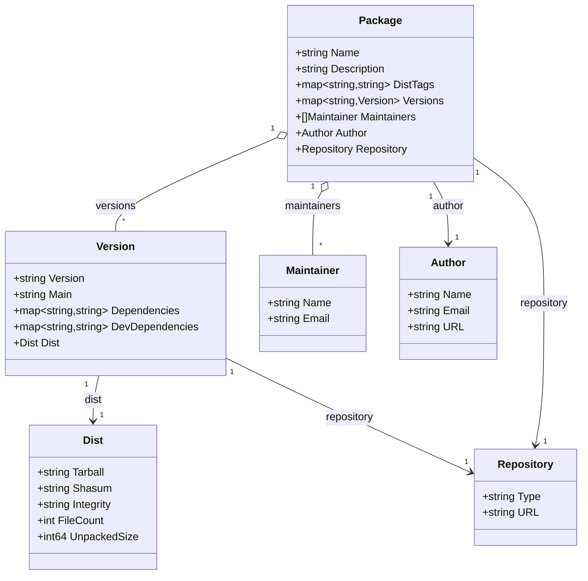
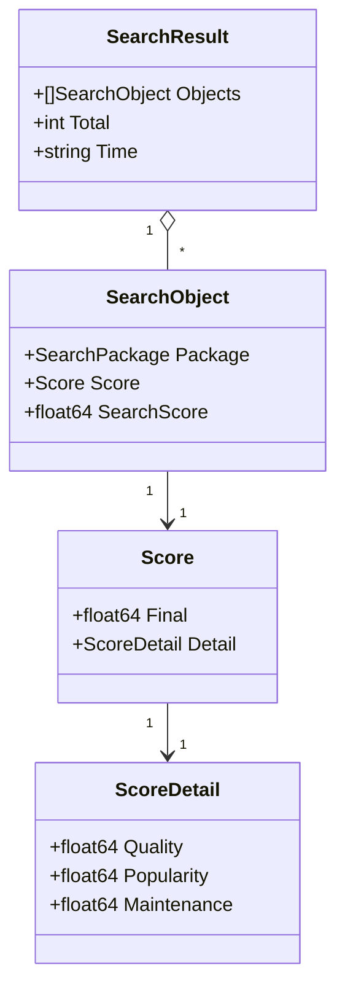
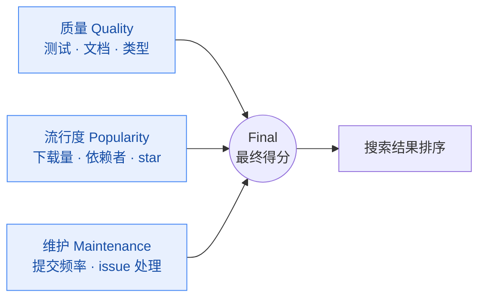

# 数据模型

NPM Skills 定义了完整的 Go 数据结构来表示 NPM 包的各种元数据信息。

## 模型关系总览

`Package` 是聚合根：它按版本号映射到多个 `Version`，每个 `Version` 又持有 `Dist`（分发/校验）与依赖表。搜索、下载统计、注册表信息则是独立的顶层模型：



搜索与统计相关模型的组合关系：



## Package 模型

表示 NPM 包的完整信息：

```go
type Package struct {
    ID             string                 `json:"_id"`             // 包 ID
    Name           string                 `json:"name"`            // 包名称
    Description    string                 `json:"description"`     // 包描述
    DistTags       map[string]string      `json:"dist-tags"`       // 分发标签
    Versions       map[string]Version     `json:"versions"`        // 版本信息
    Maintainers    []Maintainer           `json:"maintainers"`     // 维护者
    Time           map[string]string      `json:"time"`            // 时间信息
    Repository     Repository             `json:"repository"`      // 仓库信息
    Homepage       string                 `json:"homepage"`        // 主页
    License        string                 `json:"license"`         // 许可证
    Keywords       []string               `json:"keywords"`        // 关键词
    Author         Author                 `json:"author"`          // 作者
    // ... 其他字段
}
```

### 常用操作

```go
// 获取最新版本
latestVersion := pkg.DistTags["latest"]

// 列出所有可用版本
for version := range pkg.Versions {
    fmt.Printf("可用版本: %s\n", version)
}

// 获取特定版本详情
if versionInfo, exists := pkg.Versions["1.0.0"]; exists {
    fmt.Printf("依赖: %+v\n", versionInfo.Dependencies)
    fmt.Printf("开发依赖: %+v\n", versionInfo.DevDependencies)
}

// 访问作者信息
fmt.Printf("作者: %s <%s>\n", pkg.Author.Name, pkg.Author.Email)

// 访问仓库信息
if pkg.Repository.Type == "git" {
    fmt.Printf("Git 仓库: %s\n", pkg.Repository.URL)
}
```

## Version 模型

表示包的特定版本信息：

```go
type Version struct {
    Name            string               `json:"name"`            // 包名称
    Version         string               `json:"version"`         // 版本号
    Description     string               `json:"description"`     // 描述
    Main            string               `json:"main"`            // 入口点
    Scripts         Script               `json:"scripts"`         // NPM 脚本
    Dependencies    map[string]string    `json:"dependencies"`    // 运行时依赖
    DevDependencies map[string]string    `json:"devDependencies"` // 开发依赖
    Repository      *Repository          `json:"repository"`      // 仓库
    License         string               `json:"license"`         // 许可证
    Dist            *Dist                `json:"dist"`            // 分发信息
    // ... 其他字段
}
```

### 使用示例

```go
// 检查版本依赖
if len(version.Dependencies) > 0 {
    fmt.Println("运行时依赖:")
    for dep, ver := range version.Dependencies {
        fmt.Printf("  %s: %s\n", dep, ver)
    }
}

// 检查开发依赖
if len(version.DevDependencies) > 0 {
    fmt.Println("开发依赖:")
    for dep, ver := range version.DevDependencies {
        fmt.Printf("  %s: %s\n", dep, ver)
    }
}

// 访问分发信息
if version.Dist != nil {
    fmt.Printf("包大小: %d 字节\n", version.Dist.UnpackedSize)
    fmt.Printf("Tarball: %s\n", version.Dist.Tarball)
    fmt.Printf("SHA-1: %s\n", version.Dist.Shasum)
}
```

## Author 模型

表示作者信息：

```go
type Author struct {
    Name  string `json:"name"`  // 作者姓名
    Email string `json:"email"` // 邮箱地址
    Url   string `json:"url"`   // 个人网站
}
```

## Maintainer 模型

表示维护者信息：

```go
type Maintainer struct {
    Name  string `json:"name"`  // 维护者姓名
    Email string `json:"email"` // 邮箱地址
    Url   string `json:"url"`   // 个人网站
}
```

## Repository 模型

表示代码仓库信息：

```go
type Repository struct {
    Type      string `json:"type"`      // 仓库类型 (git, svn 等)
    URL       string `json:"url"`       // 仓库 URL
    Directory string `json:"directory"` // 包在仓库中的目录（monorepo 场景，如 "packages/core"）
}
```

### 使用示例

```go
// 检查是否为 Git 仓库
if pkg.Repository.Type == "git" {
    fmt.Printf("Git 仓库地址: %s\n", pkg.Repository.URL)
    
    // 从 GitHub URL 提取信息
    if strings.Contains(pkg.Repository.URL, "github.com") {
        fmt.Println("这是一个 GitHub 项目")
    }
}
```

## Dist 模型

表示包的分发信息：

```go
type Dist struct {
    Integrity    string       `json:"integrity"`    // 完整性校验
    Shasum       string       `json:"shasum"`       // SHA-1 校验和
    Tarball      string       `json:"tarball"`      // 包下载地址
    Signatures   []*Signature `json:"signatures"`   // 签名信息列表
    FileCount    int          `json:"fileCount"`    // 文件数量
    UnpackedSize int64        `json:"unpackedSize"` // 解压后大小
    NpmSignature string       `json:"npm-signature"` // NPM 签名
}

type Signature struct {
    Keyid string `json:"keyid"` // 签名密钥的 ID
    Sig   string `json:"sig"`   // 签名内容
}
```

### 使用示例

```go
if version.Dist != nil {
    fmt.Printf("包大小: %.2f KB\n", float64(version.Dist.UnpackedSize)/1024)
    fmt.Printf("文件数量: %d\n", version.Dist.FileCount)
    fmt.Printf("下载地址: %s\n", version.Dist.Tarball)
    
    // 验证校验和
    fmt.Printf("SHA-1: %s\n", version.Dist.Shasum)
    if version.Dist.Integrity != "" {
        fmt.Printf("完整性: %s\n", version.Dist.Integrity)
    }
}
```

## SearchResult 模型

表示搜索结果：

```go
type SearchResult struct {
    Objects []SearchObject `json:"objects"` // 搜索结果对象
    Total   int            `json:"total"`   // 总匹配数量
    Time    string         `json:"time"`    // 搜索耗时
}

type SearchObject struct {
    Package     SearchPackage `json:"package"`     // 包信息
    Score       Score         `json:"score"`       // 评分
    SearchScore float64       `json:"searchScore"` // 搜索得分
}

type SearchPackage struct {
    Name        string   `json:"name"`        // 包名称
    Scope       string   `json:"scope"`       // 包作用域
    Version     string   `json:"version"`     // 版本
    Description string   `json:"description"` // 描述
    Keywords    []string `json:"keywords"`    // 关键词
    Date        string   `json:"date"`        // 发布日期
    Links       Links    `json:"links"`       // 相关链接
    Author      *User    `json:"author"`      // 作者
    Publisher   *User    `json:"publisher"`   // 发布者
    Maintainers []*User  `json:"maintainers"` // 维护者列表
    ExactName   string   `json:"exactName"`   // 精确匹配的包名
}

type Score struct {
    Final  float64     `json:"final"`  // 最终得分
    Detail ScoreDetail `json:"detail"` // 详细评分
}

type ScoreDetail struct {
    Quality     float64 `json:"quality"`     // 质量得分
    Popularity  float64 `json:"popularity"`  // 流行度得分
    Maintenance float64 `json:"maintenance"` // 维护得分
}
```

`Score.Final` 由三个子维度加权合成，搜索时可通过 `--quality / --popularity / --maintenance` 调整各维度权重：



### 使用示例

```go
result, err := client.SearchPackages(ctx, "react", 10)
if err != nil {
    log.Fatal(err)
}

fmt.Printf("搜索耗时: %s\n", result.Time)
fmt.Printf("找到 %d 个结果\n", result.Total)

for i, obj := range result.Objects {
    pkg := obj.Package
    score := obj.Score
    
    fmt.Printf("%d. %s@%s\n", i+1, pkg.Name, pkg.Version)
    fmt.Printf("   描述: %s\n", pkg.Description)
    fmt.Printf("   得分: %.2f (质量: %.2f, 流行度: %.2f, 维护: %.2f)\n", 
        score.Final, score.Detail.Quality, score.Detail.Popularity, score.Detail.Maintenance)
    
    if len(pkg.Keywords) > 0 {
        fmt.Printf("   关键词: %s\n", strings.Join(pkg.Keywords, ", "))
    }
    
    fmt.Println()
}
```

## DownloadStats 模型

表示下载统计信息：

```go
type DownloadStats struct {
    Downloads int    `json:"downloads"` // 下载次数
    Start     string `json:"start"`     // 统计开始日期
    End       string `json:"end"`       // 统计结束日期
    Package   string `json:"package"`   // 包名称
}
```

### 使用示例

```go
stats, err := client.GetDownloadStats(ctx, "react", "last-week")
if err != nil {
    log.Fatal(err)
}

fmt.Printf("包: %s\n", stats.Package)
fmt.Printf("下载次数: %s\n", formatNumber(stats.Downloads))
fmt.Printf("统计周期: %s 到 %s\n", stats.Start, stats.End)

// 格式化数字显示
func formatNumber(n int) string {
    if n >= 1000000 {
        return fmt.Sprintf("%.1fM", float64(n)/1000000)
    }
    if n >= 1000 {
        return fmt.Sprintf("%.1fK", float64(n)/1000)
    }
    return fmt.Sprintf("%d", n)
}
```

## RegistryInformation 模型

表示注册表信息：

```go
type RegistryInformation struct {
    DbName            string `json:"db_name"`              // 数据库名称
    DocCount          int    `json:"doc_count"`            // 包总数
    DocDelCount       int    `json:"doc_del_count"`        // 已删除包数
    UpdateSeq         int    `json:"update_seq"`           // 更新序列
    CompactRunning    bool   `json:"compact_running"`      // 压缩状态
    DiskSize          int64  `json:"disk_size"`            // 磁盘使用
    DataSize          int64  `json:"data_size"`            // 数据大小
    InstanceStartTime string `json:"instance_start_time"`  // 启动时间
    // ... 其他字段
}
```

### 使用示例

```go
info, err := client.GetRegistryInformation(ctx)
if err != nil {
    log.Fatal(err)
}

fmt.Printf("注册表: %s\n", info.DbName)
fmt.Printf("包总数: %s\n", formatNumber(info.DocCount))
fmt.Printf("已删除包: %s\n", formatNumber(info.DocDelCount))
fmt.Printf("活跃包: %s\n", formatNumber(info.DocCount-info.DocDelCount))

fmt.Printf("磁盘使用: %s\n", formatBytes(info.DiskSize))
fmt.Printf("数据大小: %s\n", formatBytes(info.DataSize))

if info.CompactRunning {
    fmt.Println("状态: 正在压缩")
} else {
    fmt.Println("状态: 正常")
}

// 格式化字节大小
func formatBytes(bytes int64) string {
    const unit = 1024
    if bytes < unit {
        return fmt.Sprintf("%d B", bytes)
    }
    div, exp := int64(unit), 0
    for n := bytes / unit; n >= unit; n /= unit {
        div *= unit
        exp++
    }
    return fmt.Sprintf("%.1f %cB", float64(bytes)/float64(div), "KMGTPE"[exp])
}
```

## Script 模型

表示 NPM 脚本命令。SDK 将其定义为 `map[string]string` 类型别名，以支持 `package.json` 中定义的任意脚本命令（如 `build`、`lint`、`dev` 等非标准脚本）：

```go
type Script map[string]string
```

### 使用示例

```go
// version.Scripts 是 Script 类型（map[string]string）
for name, cmd := range version.Scripts {
    fmt.Printf("%s: %s\n", name, cmd)
}
// 常用键: "test" / "start" / "build" / "lint" / "dev"
```

## DownloadRangeStats 模型

表示某包在一段时间内每日的下载趋势（对应 `GetDownloadRangeStats` / `GetDownloadRangeStatsByDateRange`）：

```go
type DownloadRangeStats struct {
    Start     string           `json:"start"`     // 统计开始日期
    End       string           `json:"end"`       // 统计结束日期
    Package   string           `json:"package"`   // 包名称
    Downloads []DailyDownloads `json:"downloads"` // 每日下载统计
}

type DailyDownloads struct {
    Day       string `json:"day"`       // 日期
    Downloads int    `json:"downloads"` // 当日下载量
}
```

### 使用示例

```go
stats, err := client.GetDownloadRangeStats(ctx, "react", "last-week")
// 绘制趋势图
for _, d := range stats.Downloads {
    fmt.Printf("%s: %d\n", d.Day, d.Downloads)
}
```

## Advisory 模型

表示一条安全公告（对应 `GetAdvisory` / `ListAdvisories` / `QuickAudit` / `BulkAudit`）：

```go
type Advisory struct {
    ID             int             `json:"id"`
    Created        string          `json:"created"`
    Updated        string          `json:"updated"`
    Title          string          `json:"title"`
    Severity       string          `json:"severity"` // "low" / "moderate" / "high" / "critical"
    CVE            string          `json:"cve,omitempty"`
    CWE            string          `json:"cwe,omitempty"`
    ModuleName     string          `json:"module_name"`
    Vulnerable     string          `json:"vulnerable_versions"`
    Patched        string          `json:"patched_versions"`
    URL            string          `json:"url"`
    Overview       string          `json:"overview,omitempty"`
    Recommendation string          `json:"recommendation,omitempty"`
    References     json.RawMessage `json:"references,omitempty"` // 字符串或字符串数组
    Access         string          `json:"access,omitempty"`
}
```

### 使用示例

```go
adv, err := client.GetAdvisory(ctx, 123)
if err != nil {
    return err
}
fmt.Printf("[%s] %s\n", adv.Severity, adv.Title)
fmt.Printf("受影响版本: %s\n", adv.Vulnerable)
fmt.Printf("已修复版本: %s\n", adv.Patched)
fmt.Printf("详情: %s\n", adv.URL)
```

## Hook 模型

表示一个 NPM webhook（对应 `ListHooks` / `GetHook` / `CreateHook` / `UpdateHook`）：

```go
type Hook struct {
    ID       string   `json:"id"`
    Type     string   `json:"type"`
    Name     string   `json:"name"`
    Endpoint string   `json:"endpoint"`
    Secret   string   `json:"secret,omitempty"`
    Created  string   `json:"created"`
    Updated  string   `json:"updated"`
    Events   []string `json:"events"`           // 监听的事件类型
    Package  string   `json:"package,omitempty"`
    Active   bool     `json:"active"`
    Deleted  bool     `json:"deleted,omitempty"`
}
```

### 使用示例

```go
hooks, err := client.ListHooks(ctx, models.HookListOptions{})
for _, h := range hooks {
    fmt.Printf("%s -> %s (active=%v, events=%v)\n", h.Name, h.Endpoint, h.Active, h.Events)
}

// 创建 webhook
created, err := client.CreateHook(ctx, &models.HookCreation{
    Name:     "my-hook",
    Endpoint: "https://example.com/webhook",
    Secret:   "shared-secret",
    Events:   []string{"package:dist-tag"},
})
```

## Token 模型

表示一个 API 访问令牌（对应 `ListTokens` / `GetToken` / `CreateToken` / `DeleteToken`）：

```go
type Token struct {
    ID       string    `json:"id"`
    Token    string    `json:"token"`     // 完整令牌值（仅创建时返回）
    Key      string    `json:"key"`
    Created  time.Time `json:"created"`
    Updated  time.Time `json:"updated"`
    Readonly bool      `json:"readonly"`  // 是否只读
    CIDR     []string  `json:"cidr_whitelist,omitempty"` // CIDR 白名单
}
```

::: warning 令牌安全
`Token.Token` 字段包含完整令牌明文，仅在创建时返回。请妥善保管，切勿写入日志或提交到版本控制。日常使用建议设置 `Readonly: true` 并配 `CIDR` 白名单。
:::

## Organization 模型

表示一个 NPM 组织（对应 `GetOrg` / `CreateOrg`）：

```go
type Organization struct {
    Name  string `json:"name"`
    Scope string `json:"scope,omitempty"` // 组织作用域，如 "@my-org"
}
```

## Team 模型

表示组织内的一个团队（对应 `ListTeams` / `CreateTeam`）：

```go
type Team struct {
    ID          string `json:"id"`
    Name        string `json:"name"`
    DisplayName string `json:"display_name,omitempty"`
    Description string `json:"description,omitempty"`
}
```

## Collaborator 模型

表示包的协作者（对应 `ListCollaborators`）：

```go
type Collaborator struct {
    Name        string `json:"name"`
    Email       string `json:"email,omitempty"`
    Permissions string `json:"permissions"` // "read" 或 "write"
}
```

## PackageAccess 模型

表示包的访问权限设置（对应 `GetPackageAccess` / `SetPackageAccess`）：

```go
type PackageAccess struct {
    Package string            `json:"package"`
    Access  map[string]string `json:"access"` // 如 {"read": "public", "write": "restricted"}
}
```

## UserProfile 模型

表示用户资料（对应 `GetUser`）：

```go
type UserProfile struct {
    ID            string `json:"_id"`            // 格式: "org.couchdb.user:<name>"
    Rev           string `json:"_rev"`           // CouchDB 文档修订版本
    Name          string `json:"name"`           // 用户名
    Email         string `json:"email"`          // 邮箱地址
    Type          string `json:"type"`           // 通常为 "user"
    EmailVerified bool   `json:"email_verified"` // 邮箱是否已验证
    Avatar        string `json:"avatar,omitempty"`
    GitHub        string `json:"github,omitempty"`
    Created       string `json:"created,omitempty"`
    Updated       string `json:"updated,omitempty"`
}
```

## LoginResult 模型

表示登录 / 注册的返回结果（对应 `Login` / `CreateUser`）：

```go
type LoginResult struct {
    ID    string `json:"id"`
    Rev   string `json:"rev"`
    Token string `json:"token"` // 认证 token，可用于后续写操作
    Ok    OkBool `json:"ok"`    // 是否成功
}
```

## User 模型

表示用户/作者/发布者（被 `SearchPackage`、`Version` 等引用）：

```go
type User struct {
    Name  string `json:"name"`  // 用户名称
    Email string `json:"email"` // 电子邮件地址
    URL   string `json:"url"`   // 用户网站
}
```

## Links 模型

表示搜索结果中包的相关链接：

```go
type Links struct {
    NPM        string `json:"npm"`        // NPM 页面链接
    Homepage   string `json:"homepage"`   // 主页链接
    Repository string `json:"repository"` // 仓库链接
    Bugs       string `json:"bugs"`       // 问题跟踪链接
}
```

## Contributor 模型

表示包的贡献者（`Package.Contributors`）：

```go
type Contributor struct {
    Name  string `json:"name"`  // 贡献者名称
    Email string `json:"email"` // 电子邮件地址
    Url   string `json:"url"`   // 相关网站链接
}
```

## Attachment 模型

表示发布时携带的 tarball 附件（`Package.Attachments`）：

```go
type Attachment struct {
    ContentType string `json:"content_type"`
    Data        string `json:"data"`   // Base64 编码的 tarball 数据
    Length      int    `json:"length"` // 字节大小
}
```

## 数据验证

### 包名验证

```go
func isValidPackageName(name string) bool {
    // NPM 包名规则
    if len(name) == 0 || len(name) > 214 {
        return false
    }
    
    // 不能包含大写字母
    if strings.ToLower(name) != name {
        return false
    }
    
    // 不能以点或下划线开头
    if strings.HasPrefix(name, ".") || strings.HasPrefix(name, "_") {
        return false
    }
    
    // 只能包含 URL 安全字符
    matched, _ := regexp.MatchString(`^[a-z0-9._~-]+$`, name)
    return matched
}
```

### 版本号验证

```go
func isValidSemVer(version string) bool {
    // 简单的语义化版本验证
    pattern := `^(0|[1-9]\d*)\.(0|[1-9]\d*)\.(0|[1-9]\d*)(?:-((?:0|[1-9]\d*|\d*[a-zA-Z-][0-9a-zA-Z-]*)(?:\.(?:0|[1-9]\d*|\d*[a-zA-Z-][0-9a-zA-Z-]*))*))?(?:\+([0-9a-zA-Z-]+(?:\.[0-9a-zA-Z-]+)*))?$`
    matched, _ := regexp.MatchString(pattern, version)
    return matched
}
```

## 类型转换工具

### JSON 序列化

```go
import "encoding/json"

// 将包信息转换为 JSON
func packageToJSON(pkg *models.Package) ([]byte, error) {
    return json.MarshalIndent(pkg, "", "  ")
}

// 从 JSON 解析包信息
func packageFromJSON(data []byte) (*models.Package, error) {
    var pkg models.Package
    err := json.Unmarshal(data, &pkg)
    return &pkg, err
}
```

### 数据提取

```go
// 提取包的所有依赖（包括开发依赖）
func getAllDependencies(version *models.Version) map[string]string {
    deps := make(map[string]string)
    
    // 添加运行时依赖
    for name, ver := range version.Dependencies {
        deps[name] = ver
    }
    
    // 添加开发依赖
    for name, ver := range version.DevDependencies {
        deps[name+"@dev"] = ver
    }
    
    return deps
}

// 获取包的所有版本号，按语义化版本排序
func getSortedVersions(pkg *models.Package) []string {
    versions := make([]string, 0, len(pkg.Versions))
    for version := range pkg.Versions {
        versions = append(versions, version)
    }
    
    // 这里可以使用语义化版本排序库
    // sort.Slice(versions, func(i, j int) bool {
    //     return semver.Compare(versions[i], versions[j]) < 0
    // })
    
    return versions
}
```

## 下一步

- 查阅 [Registry 客户端](registry.md) 了解各方法文档
- 参考 [配置选项](configuration.md) 了解客户端设置
- 浏览 [示例](../examples/) 学习实战用法