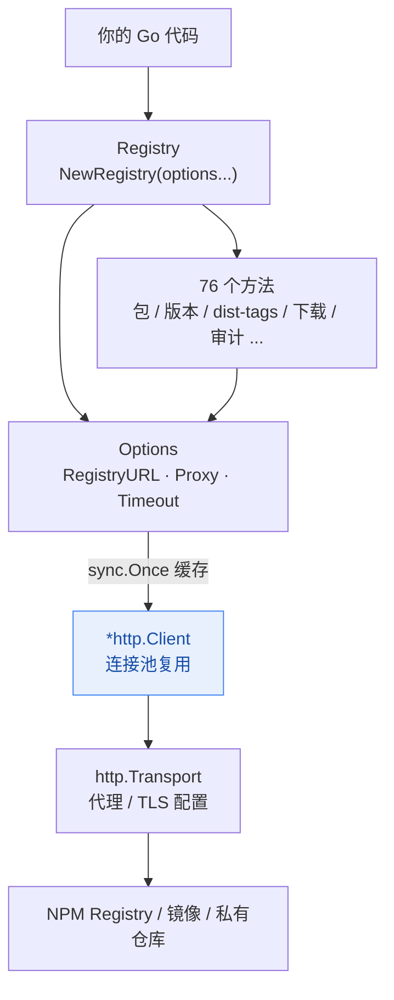
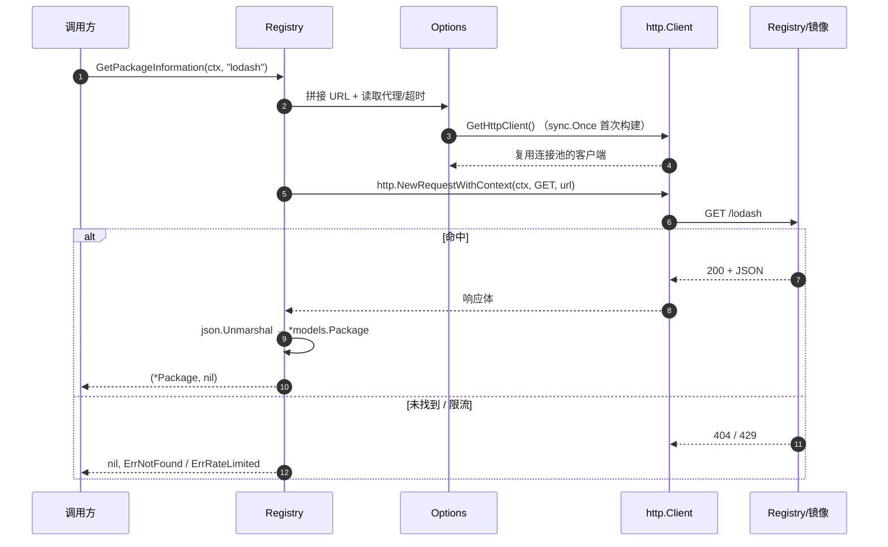
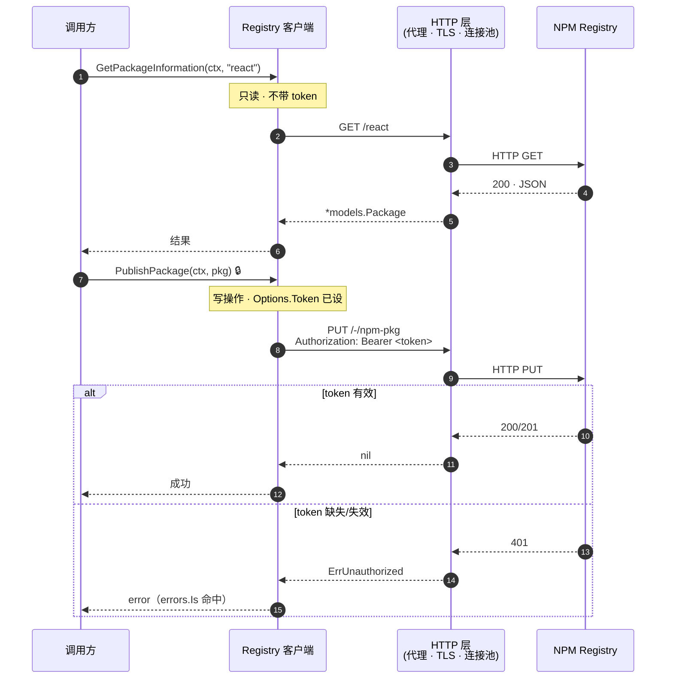
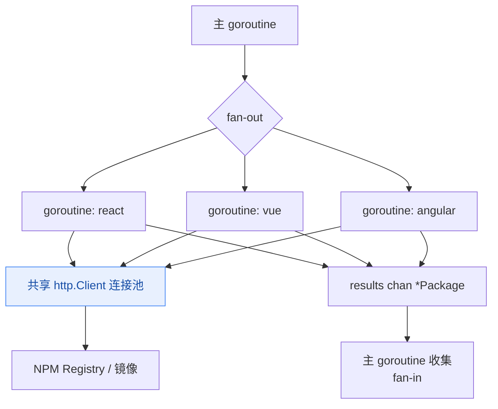

# Registry 客户端

Registry 客户端是 NPM Skills 的核心组件，提供与 NPM 注册表交互的所有功能。

## 组件架构

`Registry` 持有一份 `Options`，`Options` 内部用 `sync.Once` 惰性构建并缓存 `*http.Client`，从而在多次请求间复用底层 TCP 连接池：



## 请求生命周期

以 `GetPackageInformation` 为例，一次调用经历如下阶段——`context` 贯穿始终，可随时取消或超时：



## 创建客户端

### `NewRegistry(options ...*Options) *Registry`

创建一个新的 Registry 客户端实例。

**参数:**
- `options` - 可选的配置选项

**示例:**
```go
// 使用默认配置
client := registry.NewRegistry()

// 使用自定义配置
options := registry.NewOptions().
    SetRegistryURL("https://registry.npmjs.org").
    SetProxy("http://proxy.example.com:8080")
client := registry.NewRegistry(options)
```

## 核心方法

### `GetPackageInformation(ctx context.Context, packageName string) (*models.Package, error)`

获取指定 NPM 包的详细信息。

**参数:**
- `ctx` - 上下文，用于取消和超时控制
- `packageName` - 要查询的包名称

**返回值:**
- `*models.Package` - 完整的包信息
- `error` - 如果请求失败则返回错误

**示例:**
```go
ctx, cancel := context.WithTimeout(context.Background(), 10*time.Second)
defer cancel()

pkg, err := client.GetPackageInformation(ctx, "lodash")
if err != nil {
    return fmt.Errorf("获取包信息失败: %w", err)
}

// 访问包数据
fmt.Printf("名称: %s\n", pkg.Name)
fmt.Printf("最新版本: %s\n", pkg.DistTags["latest"])
fmt.Printf("作者: %s\n", pkg.Author.Name)

// 访问特定版本
if version, exists := pkg.Versions["4.17.21"]; exists {
    fmt.Printf("版本 4.17.21 依赖: %+v\n", version.Dependencies)
}
```

### `GetRegistryInformation(ctx context.Context) (*models.RegistryInformation, error)`

获取 NPM 注册表的状态和元数据信息。

**参数:**
- `ctx` - 上下文，用于取消和超时控制

**返回值:**
- `*models.RegistryInformation` - 注册表状态信息
- `error` - 如果请求失败则返回错误

**示例:**
```go
info, err := client.GetRegistryInformation(ctx)
if err != nil {
    return fmt.Errorf("获取注册表信息失败: %w", err)
}

fmt.Printf("注册表: %s\n", info.DbName)
fmt.Printf("包总数: %d\n", info.DocCount)
fmt.Printf("数据库大小: %d 字节\n", info.DataSize)
fmt.Printf("磁盘使用: %d 字节\n", info.DiskSize)
```

### `SearchPackages(ctx context.Context, query string, limit int) (*models.SearchResult, error)`

搜索 NPM 包。

**参数:**
- `ctx` - 上下文
- `query` - 搜索关键字
- `limit` - 返回结果数量限制，默认为 20

**返回值:**
- `*models.SearchResult` - 搜索结果
- `error` - 如果请求失败则返回错误

**示例:**
```go
result, err := client.SearchPackages(ctx, "react", 10)
if err != nil {
    return fmt.Errorf("搜索失败: %w", err)
}

fmt.Printf("找到 %d 个结果\n", result.Total)
for _, obj := range result.Objects {
    pkg := obj.Package
    fmt.Printf("包名: %s\n", pkg.Name)
    fmt.Printf("版本: %s\n", pkg.Version)
    fmt.Printf("描述: %s\n", pkg.Description)
    fmt.Printf("评分: %.2f\n", obj.Score.Final)
    fmt.Println("---")
}
```

### `GetPackageVersion(ctx context.Context, packageName, version string) (*models.Version, error)`

获取指定包的特定版本信息。

**参数:**
- `ctx` - 上下文
- `packageName` - 包名称
- `version` - 版本号或标签（如 "1.0.0" 或 "latest"）

**返回值:**
- `*models.Version` - 版本详细信息
- `error` - 如果请求失败则返回错误

**示例:**
```go
version, err := client.GetPackageVersion(ctx, "react", "18.2.0")
if err != nil {
    return fmt.Errorf("获取版本信息失败: %w", err)
}

fmt.Printf("版本: %s\n", version.Version)
fmt.Printf("描述: %s\n", version.Description)
fmt.Printf("依赖: %+v\n", version.Dependencies)
fmt.Printf("开发依赖: %+v\n", version.DevDependencies)
```

### `GetDownloadStats(ctx context.Context, packageName, period string) (*models.DownloadStats, error)`

获取指定包的下载统计信息。

**参数:**
- `ctx` - 上下文
- `packageName` - 包名称
- `period` - 统计周期（"last-day", "last-week", "last-month"）

**返回值:**
- `*models.DownloadStats` - 下载统计信息
- `error` - 如果请求失败则返回错误

**示例:**
```go
stats, err := client.GetDownloadStats(ctx, "react", "last-week")
if err != nil {
    return fmt.Errorf("获取下载统计失败: %w", err)
}

fmt.Printf("包: %s\n", stats.Package)
fmt.Printf("下载次数: %d\n", stats.Downloads)
fmt.Printf("统计周期: %s 到 %s\n", stats.Start, stats.End)
```

### `DownloadTarball(ctx context.Context, packageName, version, destPath string) error`

下载指定 NPM 包的 tarball 文件到本地路径。

**参数:**
- `ctx` - 上下文，用于取消和超时控制
- `packageName` - 要下载的包名称，例如 "react"、"lodash" 等
- `version` - 要下载的版本号，例如 "18.0.0"、"latest" 等
- `destPath` - 目标文件保存路径，例如 "./downloads/react-18.0.0.tgz"

**返回值:**
- `error` - 如果下载失败则返回错误

**示例:**
```go
ctx := context.Background()

// 下载 react 18.0.0 版本到本地文件
err := client.DownloadTarball(ctx, "react", "18.0.0", "./react.tgz")
if err != nil {
    return fmt.Errorf("下载 tarball 失败: %w", err)
}

// 使用 latest 下载最新版本
err = client.DownloadTarball(ctx, "vue", "latest", "./vue.tgz")
if err != nil {
    return fmt.Errorf("下载 tarball 失败: %w", err)
}

// 验证下载的文件
info, err := os.Stat("./react.tgz")
if err != nil {
    return err
}
fmt.Printf("文件大小: %d bytes\n", info.Size())
```

**使用 CNPM 镜像下载示例:**
```go
// 使用国内镜像下载，速度更快
options := registry.NewOptions().SetRegistryURL(registry.RegistryUrlCnpm)
client := registry.NewRegistry(options)

err := client.DownloadTarball(ctx, "axios", "1.0.0", "/tmp/axios.tgz")
if err != nil {
    log.Fatalf("下载失败: %v", err)
}

fmt.Println("下载成功！")
```

### `GetOptions() *Options`

返回当前注册表客户端的配置选项。

**返回值:**
- `*Options` - 当前配置选项

## 方法索引（76 个）

下面按功能域列出全部 76 个方法。`ctx` 均为 `context.Context`；标注 🔒 的写操作需要服务端配置有效 token（`Options.Token`）。

只读请求直接走镜像/代理发往 Registry；写操作则在请求头注入 `Authorization: Bearer <token>`，由 Registry 鉴权后写入：



### 包元数据（只读）

| 方法 | 签名 | 说明 |
|------|------|------|
| `GetPackageInformation` | `(ctx, name) → *models.Package, error` | 完整包元数据（可能很大，10MB+） |
| `GetPackageInformationSummary` | `(ctx, name) → *models.Package, error` | 轻量摘要（推荐） |
| `GetAbbreviatedPackageInformation` | `(ctx, name) → *models.Package, error` | 缩写元数据 |
| `GetPackageVersion` | `(ctx, name, version) → *models.Version, error` | 特定版本元数据 |
| `GetPackageVersions` | `(ctx, name) → []string, error` | 所有版本号 |
| `GetPackageVersionCount` | `(ctx, name) → int, error` | 版本总数 |
| `GetPackageLatestVersion` | `(ctx, name) → string, error` | 最新版本号（仅查 dist-tags） |

### dist-tags

| 方法 | 签名 | 说明 |
|------|------|------|
| `GetDistTags` | `(ctx, name) → map[string]string, error` | 全部 dist-tags |
| `GetDistTagsAbbreviated` | `(ctx, name) → map[string]string, error` | 缩写形式 dist-tags |
| `GetDistTag` | `(ctx, name, tag) → string, error` | 单个 tag 指向的版本 |
| `SetDistTag` 🔒 | `(ctx, name, tag, version) → error` | 设置单个 dist-tag |
| `SetDistTags` 🔒 | `(ctx, name, tags) → error` | 批量设置 dist-tags |
| `DeleteDistTag` 🔒 | `(ctx, name, tag) → error` | 删除 dist-tag |

### 搜索

| 方法 | 签名 | 说明 |
|------|------|------|
| `SearchPackages` | `(ctx, query, limit) → *models.SearchResult, error` | 关键字搜索（分页） |
| `SearchPackagesWithOptions` | `(ctx, query, opts SearchOptions) → *models.SearchResult, error` | 加权 / 偏移等高级搜索 |

### 下载统计（始终查 `api.npmjs.org`）

| 方法 | 签名 | 说明 |
|------|------|------|
| `GetDownloadStats` | `(ctx, name, period) → *models.DownloadStats, error` | 区间下载总量 |
| `GetDownloadStatsByDateRange` | `(ctx, name, start, end) → *models.DownloadStats, error` | 自定义日期区间 |
| `GetDownloadRangeStats` | `(ctx, name, period) → *models.DownloadRangeStats, error` | 每日下载趋势 |
| `GetDownloadRangeStatsByDateRange` | `(ctx, name, start, end) → *models.DownloadRangeStats, error` | 自定义区间每日趋势 |
| `GetBulkDownloadStats` | `(ctx, names []string, period) → map[string]*models.DownloadStats, error` | 批量包下载总量 |
| `GetBulkDownloadStatsByDateRange` | `(ctx, names, start, end) → map[string]*models.DownloadStats, error` | 批量自定义区间 |
| `GetBulkDownloadRangeStats` | `(ctx, names, period) → map[string]*models.DownloadRangeStats, error` | 批量每日趋势 |
| `GetBulkDownloadRangeStatsByDateRange` | `(ctx, names, start, end) → map[string]*models.DownloadRangeStats, error` | 批量自定义区间每日趋势 |

### 下载 tarball

| 方法 | 签名 | 说明 |
|------|------|------|
| `DownloadTarball` | `(ctx, name, version, destPath) → error` | 下载 tarball 到本地路径 |

### 安全审计（只读）

| 方法 | 签名 | 说明 |
|------|------|------|
| `QuickAudit` | `(ctx, payload *models.QuickAuditRequest) → *models.QuickAuditResult, error` | 快速审计（name→version） |
| `BulkAudit` | `(ctx, advisories map[string][]string) → map[string][]models.Advisory, error` | 批量审计 |
| `GetAdvisory` | `(ctx, advisoryID int) → *models.Advisory, error` | 按 ID 查公告 |
| `ListAdvisories` | `(ctx, opts models.AdvisoryListOptions) → []models.Advisory, error` | 公告列表 |

### Stars（只读）

| 方法 | 签名 | 说明 |
|------|------|------|
| `GetStarredByPackage` | `(ctx, name) → []string, error` | star 了某包的用户 |
| `GetStarredByUser` | `(ctx, username) → []string, error` | 某用户 star 的包 |
| `StarPackage` 🔒 | `(ctx, name) → error` | star 包 |
| `UnstarPackage` 🔒 | `(ctx, name) → error` | unstar 包 |

### 访问控制与协作者

| 方法 | 签名 | 说明 |
|------|------|------|
| `GetPackageAccess` 🔒 | `(ctx, name) → *models.PackageAccess, error` | 包访问设置 |
| `SetPackageAccess` 🔒 | `(ctx, name, access *models.PackageAccessUpdate) → error` | 更新包访问设置 |
| `GrantAccess` 🔒 | `(ctx, name, user, permission) → error` | 授予协作者权限 |
| `RevokeAccess` 🔒 | `(ctx, name, user) → error` | 移除协作者 |
| `ListCollaborators` 🔒 | `(ctx, name) → []models.Collaborator, error` | 协作者列表 |

### 发布与弃用

| 方法 | 签名 | 说明 |
|------|------|------|
| `PublishPackage` 🔒 | `(ctx, pkg *models.Package) → error` | 发布包 |
| `PublishPackageFromTarball` 🔒 | `(ctx, name, version string, tarball []byte, meta *models.PublishMetadata) → error` | 从 tarball 发布 |
| `DeprecateVersion` 🔒 | `(ctx, name, version, message) → error` | 弃用某版本 |
| `UnpublishPackage` 🔒 | `(ctx, name) → error` | 取消发布整个包（危险） |
| `UnpublishPackageVersion` 🔒 | `(ctx, name, version) → error` | 取消发布某版本 |

### Token 管理（需 token）

| 方法 | 签名 | 说明 |
|------|------|------|
| `ListTokens` | `(ctx) → []models.Token, error` | token 列表 |
| `GetToken` | `(ctx, tokenID) → *models.Token, error` | 单个 token 详情 |
| `CreateToken` 🔒 | `(ctx, opts *models.TokenCreation) → *models.Token, error` | 创建 token |
| `DeleteToken` 🔒 | `(ctx, tokenID) → error` | 删除 token |

### 用户与认证

| 方法 | 签名 | 说明 |
|------|------|------|
| `WhoAmI` | `(ctx) → string, error` | 当前认证用户名 |
| `GetUser` 🔒 | `(ctx, name) → *models.UserProfile, error` | 用户资料 |
| `Login` | `(ctx, name, password) → *models.LoginResult, error` | 登录 |
| `CreateUser` | `(ctx, user *models.UserCreation) → *models.LoginResult, error` | 注册 |

### 组织与团队（需 token）

| 方法 | 签名 | 说明 |
|------|------|------|
| `GetOrg` | `(ctx, orgName) → *models.Organization, error` | 组织详情 |
| `ListOrgMembers` | `(ctx, orgName) → []string, error` | 组织成员 |
| `ListOrgPackages` | `(ctx, orgName) → []string, error` | 组织包 |
| `CreateOrg` 🔒 | `(ctx, orgName) → *models.Organization, error` | 创建组织 |
| `DeleteOrg` 🔒 | `(ctx, orgName) → error` | 删除组织 |
| `AddOrgMember` 🔒 | `(ctx, orgName, username) → error` | 添加组织成员 |
| `RemoveOrgMember` 🔒 | `(ctx, orgName, username) → error` | 移除组织成员 |
| `ListTeams` | `(ctx, orgName) → []models.Team, error` | 团队列表 |
| `ListTeamMembers` | `(ctx, orgName, teamName) → []string, error` | 团队成员 |
| `ListTeamPackages` | `(ctx, orgName, teamName) → []string, error` | 团队包 |
| `CreateTeam` 🔒 | `(ctx, orgName, teamName) → *models.Team, error` | 创建团队 |
| `DeleteTeam` 🔒 | `(ctx, orgName, teamName) → error` | 删除团队 |
| `AddTeamMember` 🔒 | `(ctx, orgName, teamName, username) → error` | 添加团队成员 |
| `RemoveTeamMember` 🔒 | `(ctx, orgName, teamName, username) → error` | 移除团队成员 |

### Webhooks（需 token）

| 方法 | 签名 | 说明 |
|------|------|------|
| `ListHooks` | `(ctx, opts models.HookListOptions) → []models.Hook, error` | webhook 列表 |
| `GetHook` | `(ctx, hookID) → *models.Hook, error` | webhook 详情 |
| `CreateHook` 🔒 | `(ctx, hook *models.HookCreation) → *models.Hook, error` | 创建 webhook |
| `UpdateHook` 🔒 | `(ctx, hookID, hook *models.HookUpdate) → *models.Hook, error` | 更新 webhook |
| `DeleteHook` 🔒 | `(ctx, hookID) → error` | 删除 webhook |

### CouchDB 视图与变更流（高级，用于镜像 / 增量同步）

| 方法 | 签名 | 说明 |
|------|------|------|
| `GetRegistryInformation` | `(ctx) → *models.RegistryInformation, error` | 注册表状态与统计 |
| `RegistryHealthCheck` | `(ctx) → bool, error` | 注册表健康检查 |
| `IsPrivateRegistry` | `() → bool` | 是否私有注册表 |
| `GetChanges` | `(ctx, opts models.ChangesOptions) → *models.ChangesResult, error` | 变更 feed |
| `GetAllDocs` | `(ctx, opts models.AllDocsOptions) → *models.AllDocsResult, error` | 全量文档 |
| `GetView` | `(ctx, viewName, opts models.ViewOptions) → *models.ViewResult, error` | 视图查询 |

### 配置

| 方法 | 签名 | 说明 |
|------|------|------|
| `GetOptions` | `() → *Options` | 当前配置选项 |

## 镜像源

NPM Skills 内置支持多种镜像源，特别适合中国大陆用户：

### 官方镜像

```go
// NPM 官方注册表 (全球)
client := registry.NewRegistry()

// Yarn 官方镜像 (全球)
client := registry.NewYarnRegistry()
```

### 中国镜像源

```go
// 淘宝 NPM 镜像 (中国)
client := registry.NewTaoBaoRegistry()

// NPM Mirror (中国)
client := registry.NewNpmMirrorRegistry()

// 华为云镜像 (中国)
client := registry.NewHuaWeiCloudRegistry()

// 腾讯云镜像 (中国)
client := registry.NewTencentRegistry()

// CNPM 镜像 (中国)
client := registry.NewCnpmRegistry()

// NPM CouchDB 镜像
client := registry.NewNpmjsComRegistry()
```

## 最佳实践

### 超时控制

```go
// 设置合理的超时时间
ctx, cancel := context.WithTimeout(context.Background(), 30*time.Second)
defer cancel()

pkg, err := client.GetPackageInformation(ctx, "package-name")
```

### 错误处理

```go
pkg, err := client.GetPackageInformation(ctx, "package-name")
if err != nil {
    // 检查是否是网络错误
    if strings.Contains(err.Error(), "timeout") {
        log.Printf("请求超时，请检查网络连接")
    }
    // 检查是否是包不存在
    if strings.Contains(err.Error(), "404") {
        log.Printf("包不存在: %s", packageName)
    }
    return fmt.Errorf("获取包信息失败: %w", err)
}
```

### 并发访问

由于 `*http.Client` 被缓存且并发安全，多个 goroutine 可共享同一个 `Registry` 实例并发请求，底层连接池自动复用：



```go
// 使用 goroutine 并发获取多个包信息
packages := []string{"react", "vue", "angular"}
results := make(chan *models.Package, len(packages))

for _, pkg := range packages {
    go func(packageName string) {
        info, err := client.GetPackageInformation(ctx, packageName)
        if err != nil {
            log.Printf("获取 %s 失败: %v", packageName, err)
            results <- nil
            return
        }
        results <- info
    }(pkg)
}

// 收集结果
for i := 0; i < len(packages); i++ {
    result := <-results
    if result != nil {
        fmt.Printf("包: %s, 版本: %s\n", result.Name, result.DistTags["latest"])
    }
}
```

## 下一步

- 参考 [数据模型](models.md) 了解详细结构信息
- 查阅 [配置选项](configuration.md) 了解客户端自定义
- 浏览 [示例](../examples/) 学习实战用法