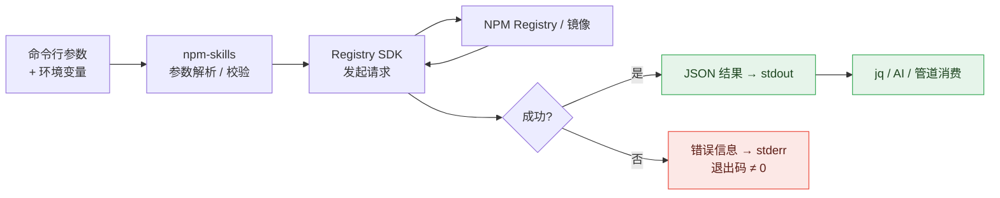
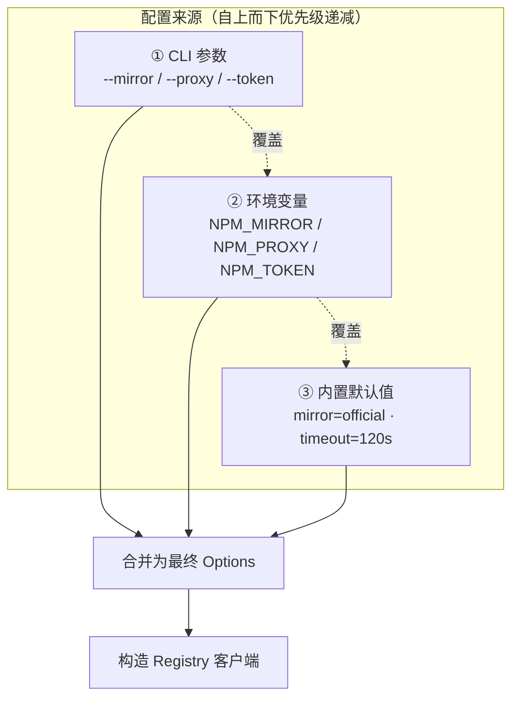
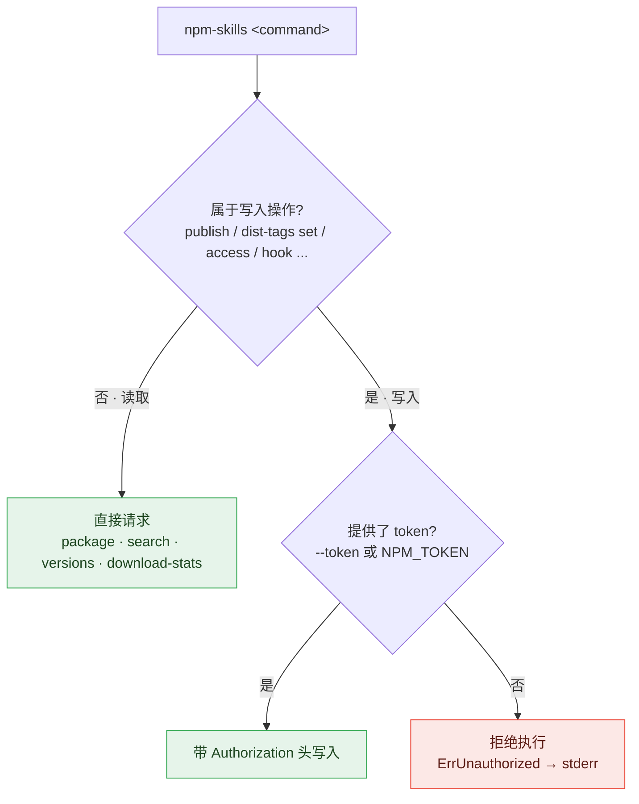
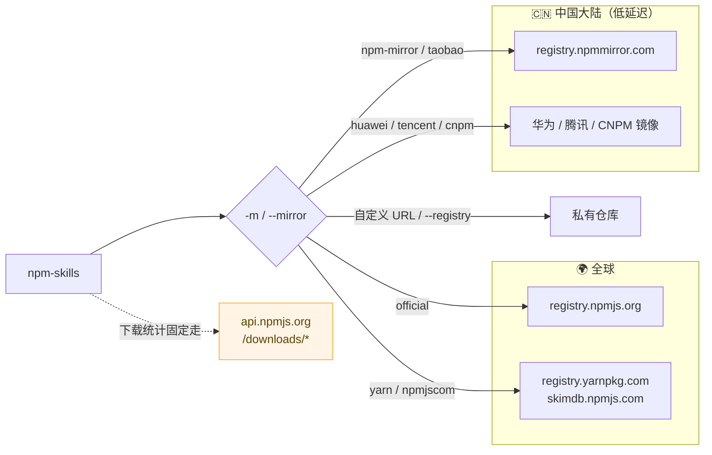

# CLI 命令手册

`npm-skills` CLI 共 26 个命令，所有命令输出 JSON 到 stdout（便于 AI 解析），状态信息走 stderr。

这种「数据走 stdout、日志走 stderr」的分离，让 CLI 既能被人阅读，也能被脚本与 AI 用 `jq` 等工具直接管道处理：



## 全局参数

| 参数 | 简写 | 默认值 | 说明 |
|------|------|--------|------|
| `--mirror` | `-m` | `official` | 镜像源名 |
| `--registry` | | | 自定义注册表 URL（覆盖 --mirror） |
| `--token` | `-t` | | NPM 认证 token（写操作必需，env: `NPM_TOKEN`） |
| `--proxy` | | | HTTP 代理 URL（env: `NPM_PROXY`） |
| `--timeout` | | `120` | 请求超时秒数 |

**优先级**：CLI 参数 > 环境变量 > 默认值



CLI 命令按是否需要认证分为两类：读取操作可匿名调用，写入操作必须提供 `--token`：



## 读取操作

### 包信息

```bash
npm-skills package-summary <name>     # 轻量包信息（推荐）
npm-skills package <name>             # 完整元数据（可能 10MB+）
npm-skills pkg-version <name> <ver>   # 特定版本
npm-skills versions <name>            # 所有版本
npm-skills versions <name> --latest   # 仅最新版本
```

> **提示**：优先用 `package-summary`，响应小得多、快得多。

### 搜索

```bash
npm-skills search <query>                  # 基础搜索
npm-skills search <query> -l 10            # 限制结果数
npm-skills search <query> --from 20 -l 10  # 分页
npm-skills search <query> --popularity 1.0 # 按流行度加权
```

| 参数 | 简写 | 默认 | 说明 |
|------|------|------|------|
| `--limit` | `-l` | 20 | 最大结果数 |
| `--from` | | 0 | 分页偏移 |
| `--quality` | | 0 | 质量权重 (0-1) |
| `--popularity` | | 0 | 流行度权重 (0-1) |
| `--maintenance` | | 0 | 维护度权重 (0-1) |

### Dist-Tags（读取）

```bash
npm-skills dist-tags get <name>
```

### 下载统计

```bash
npm-skills download-stats <name> -p last-month          # 单包
npm-skills download-range <name> -p last-week           # 每日趋势
npm-skills download-stats-date <name> --start 2024-01-01 --end 2024-06-30  # 自定义区间
npm-skills download-stats-bulk react,vue,angular -p last-month  # 批量（≤128）
```

> 下载统计始终查询 api.npmjs.org，与镜像/仓库设置无关。

### 其他读取

```bash
npm-skills registry-info                 # 仓库健康信息
npm-skills mirrors                       # 镜像源列表
npm-skills config                        # 当前配置
npm-skills whoami --token <token>        # 认证状态
npm-skills user get <username> --token <token>  # 用户资料（别名 user info）
npm-skills download <name> <ver> <dest>  # 下载 tarball

# CouchDB 视图与变更流（高级，用于镜像构建 / 增量同步）
npm-skills couchdb changes --since <seq> --limit 100 --include-docs
npm-skills couchdb all-docs --start-key a --end-key b --limit 50
npm-skills couchdb view <view-name> --key <k> --group
```

## 写入操作（需要 --token）

所有写操作都需要认证。用 `--token` 或设置 `NPM_TOKEN`。

### 发布 / 取消发布 / 弃用

```bash
npm-skills publish ./pkg.tgz --name my-pkg --version 1.0.0 -t <token>
npm-skills deprecate my-pkg 1.0.0 -M "Use v2.0.0" -t <token>
npm-skills unpublish my-pkg --version 1.0.0 -t <token>   # 危险
npm-skills unpublish my-pkg --force -t <token>           # 极危险
```

::: danger unpublish 是不可逆操作
`unpublish` 会从 registry 永久移除已发布的版本，可能导致所有依赖它的项目构建失败。npm 官方对 unpublish 有[严格的时间与条件限制](https://docs.npmjs.com/policies/unpublish)（一般仅允许发布后 72 小时内撤回）。`--force` 会跳过交互确认，请务必先确认包名与版本无误。多数场景应改用 `deprecate` 标记弃用，而非删除。
:::

### Dist-Tags 管理

```bash
npm-skills dist-tags set <name> <tag> --version <ver> -t <token>
npm-skills dist-tags delete <name> <tag> -t <token>
```

### 访问控制与协作者

```bash
npm-skills access get <name> -t <token>
npm-skills access set <name> --visibility public -t <token>
npm-skills access collaborators <name> -t <token>
npm-skills access grant <name> <user> --permission read -t <token>
npm-skills access revoke <name> <user> -t <token>
```

### Stars

```bash
npm-skills star add <name> -t <token>
npm-skills star remove <name> -t <token>
npm-skills star list <username>
npm-skills star stargazers <name>
```

### Token 管理

```bash
npm-skills token list -t <token>
npm-skills token get <id> -t <token>
npm-skills token create --password <pass> -t <token>
npm-skills token delete <id> -t <token>
```

### 用户账户

```bash
npm-skills user login --username <user> --password <pass>   # 登录获取 token
npm-skills user signup --username <user> --password <pass> --email <mail>  # 注册
```

### 安全审计

```bash
npm-skills audit quick --deps "lodash=4.17.11,express=4.17.1"
npm-skills audit bulk --advisories "lodash=<4.17.12"
npm-skills audit advisory 123
npm-skills audit advisories --package lodash
```

### 组织与团队

```bash
npm-skills org get <org> -t <token>
npm-skills org members <org> -t <token>
npm-skills org packages <org> -t <token>
npm-skills org team-list <org> -t <token>
npm-skills org team-members <org> <team> -t <token>
# ... 完整列表见 npm-skills --help
```

### Webhooks

```bash
npm-skills hook list -t <token>
npm-skills hook get <id> -t <token>
npm-skills hook create --name my-hook --endpoint https://... -t <token>
npm-skills hook update <id> --endpoint https://new... -t <token>
npm-skills hook delete <id> -t <token>
```

## 镜像源

| 镜像 | 名称 | 地域 |
|------|------|------|
| `https://registry.npmjs.org` | `official` | 全球 |
| `https://registry.npmmirror.com` | `npm-mirror` | 中国（推荐） |
| `https://registry.npm.taobao.org` | `taobao` | 中国 |
| `https://mirrors.huaweicloud.com/repository/npm` | `huawei` | 中国 |
| `http://mirrors.cloud.tencent.com/npm` | `tencent` | 中国 |
| `http://r.cnpmjs.org` | `cnpm` | 中国 |
| `https://registry.yarnpkg.com` | `yarn` | 全球 |
| `https://skimdb.npmjs.com` | `npmjscom` | 全球 |

可直接传 URL：`--mirror https://your-registry.com`

镜像源与请求路由关系如下 —— 包元数据/下载走所选镜像，而**下载统计始终固定走 `api.npmjs.org`**（镜像不提供该接口）：



::: tip 选型建议
中国大陆用户优先 `npm-mirror`（`registry.npmmirror.com`），无需代理即可获得最快速度；受限网络叠加 `--proxy` 使用官方源；企业内网用 `--registry` 指向私有注册表。
:::

## 下一步

- 阅读 [快速开始](/getting-started) 了解四种接入方式
- 查阅 [MCP 服务器](/mcp-server) 将命令暴露为 AI 工具
- 浏览 [API 文档](/api/) 了解底层 SDK 方法
