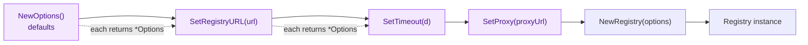
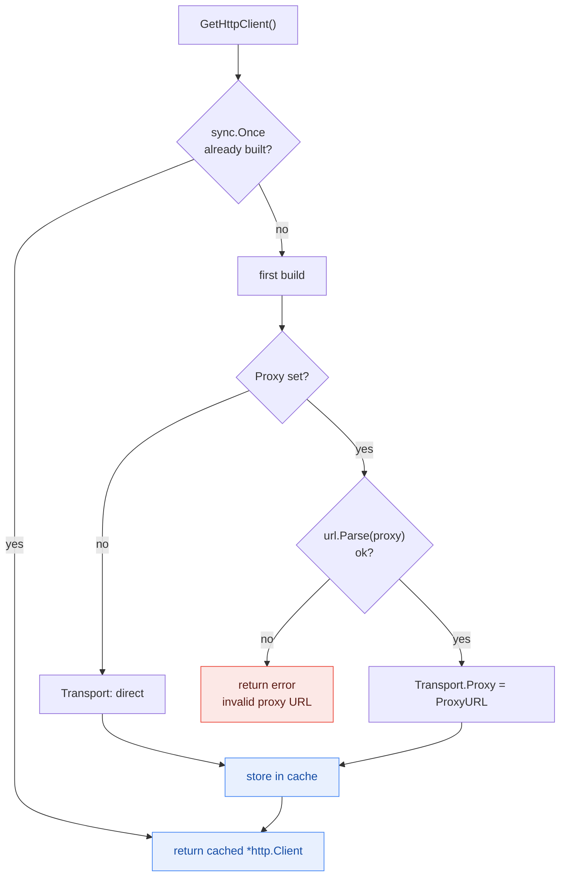

# Configuration Options

This document describes all configuration options available for customizing the NPM Skills client behavior.

## Options Structure

### Options

The main configuration structure for customizing client behavior. All fields are exported, but the recommended way to set them is through the fluent `SetXxx` methods.

```go
type Options struct {
    RegistryURL      string        // NPM registry base URL
    Proxy            string        // HTTP/HTTPS proxy URL
    Token            string        // Bearer token for authentication
    Username         string        // Basic-auth username
    Password         string        // Basic-auth password
    DownloadStatsURL string        // Base URL for the download-stats API
    Timeout          time.Duration // Per-request timeout (0 = no deadline)
    UserAgent        string        // User-Agent header sent with requests
    InsecureSkipVerify bool        // Skip TLS certificate verification
}
```

The underlying `*http.Client` is **not** a field you set directly — it is built lazily from these options on the first call to `GetHttpClient()` and cached with `sync.Once`.

## Creating Options

### NewOptions
```go
func NewOptions() *Options
```

Creates a new Options instance with default values.

**Returns:**
- `*Options` - New options instance with defaults

**Example:**
```go
options := registry.NewOptions()
```

## Configuration Methods

All configuration methods return the Options instance for method chaining.

### SetRegistryURL
```go
func (o *Options) SetRegistryURL(url string) *Options
```

Sets the NPM registry URL to use.

**Parameters:**
- `url` - Registry URL (e.g., "https://registry.npmjs.org")

**Example:**
```go
options := registry.NewOptions().
    SetRegistryURL("https://registry.npmjs.org")
```

### SetProxy
```go
func (o *Options) SetProxy(proxyURL string) *Options
```

Sets a proxy server for all requests. Changing the proxy resets the cached HTTP client so the new setting takes effect.

**Parameters:**
- `proxyURL` - Proxy server URL (e.g., "http://proxy.example.com:8080")

**Example:**
```go
options := registry.NewOptions().
    SetProxy("http://proxy.example.com:8080")
```

### SetToken
```go
func (o *Options) SetToken(token string) *Options
```

Sets a Bearer token, sent as the `Authorization: Bearer <token>` header. Use this for private registries that authenticate with npm tokens.

**Parameters:**
- `token` - Authentication token

**Example:**
```go
options := registry.NewOptions().
    SetRegistryURL("https://npm.pkg.github.com").
    SetToken("ghp_xxxxxxxxxxxx")
```

### SetBasicAuth
```go
func (o *Options) SetBasicAuth(username, password string) *Options
```

Sets HTTP Basic authentication credentials.

**Parameters:**
- `username` - Basic-auth username
- `password` - Basic-auth password

**Example:**
```go
options := registry.NewOptions().
    SetRegistryURL("https://private-registry.example.com").
    SetBasicAuth("alice", "s3cret")
```

### SetUserAgent
```go
func (o *Options) SetUserAgent(userAgent string) *Options
```

Sets a custom User-Agent header for requests.

**Parameters:**
- `userAgent` - User-Agent string

**Example:**
```go
options := registry.NewOptions().
    SetUserAgent("MyApp/1.0 (contact@example.com)")
```

### SetTimeout
```go
func (o *Options) SetTimeout(timeout time.Duration) *Options
```

Sets the per-request timeout. When `Timeout > 0`, the SDK wraps the passed context with `context.WithTimeout` before each request (this takes effect even if the caller passes `context.Background()`). The default is `0`, meaning no extra timeout is added — cancellation is then entirely up to the context the caller passes.

::: tip Relationship with context
`SetTimeout` and a caller-supplied context deadline **stack** (the earlier one wins). If you already control each call's deadline via `context.WithTimeout`, you don't need `SetTimeout`; if you reuse a single `context.Background()` across many calls and want a uniform safety net, `SetTimeout` is more convenient.
:::

**Parameters:**
- `timeout` - Request timeout duration

**Example:**
```go
options := registry.NewOptions().
    SetTimeout(30 * time.Second)
```

### SetInsecureSkipVerify
```go
func (o *Options) SetInsecureSkipVerify(skip bool) *Options
```

Controls whether TLS certificate verification is skipped. Defaults to `false` (verification enabled). Only enable this for trusted internal registries with self-signed certificates — never in production against public networks.

**Parameters:**
- `skip` - `true` to skip TLS verification

**Example:**
```go
options := registry.NewOptions().
    SetRegistryURL("https://internal-registry.local").
    SetInsecureSkipVerify(true) // self-signed cert on an internal host
```

### SetDownloadStatsURL
```go
func (o *Options) SetDownloadStatsURL(url string) *Options
```

Overrides the base URL used for download-statistics queries (default `https://api.npmjs.org`). Useful when a mirror exposes stats at a different host.

**Parameters:**
- `url` - Download-stats API base URL

**Example:**
```go
options := registry.NewOptions().
    SetDownloadStatsURL("https://api.npmjs.org")
```

### GetHttpClient
```go
func (o *Options) GetHttpClient() (*http.Client, error)
```

Builds (on first call) and returns the configured `*http.Client`, wiring in proxy, timeout and TLS settings. The client is cached with `sync.Once`, so subsequent calls reuse the same instance — and therefore the same connection pool.

**Returns:**
- `*http.Client` - The configured HTTP client
- `error` - Non-nil if the proxy URL fails to parse

**Example:**
```go
options := registry.NewOptions().
    SetProxy("http://proxy.example.com:8080")

httpClient, err := options.GetHttpClient()
if err != nil {
    log.Fatalf("failed to build HTTP client: %v", err)
}
_ = httpClient
```

## Configuration Examples

### Basic Configuration
```go
package main

import (
    "time"

    "github.com/scagogogo/npm-skills/pkg/registry"
)

func main() {
    options := registry.NewOptions().
        SetRegistryURL("https://registry.npmjs.org").
        SetTimeout(30 * time.Second)

    client := registry.NewRegistry(options)
    _ = client
}
```

### Proxy Configuration
```go
options := registry.NewOptions().
    SetRegistryURL("https://registry.npmjs.org").
    SetProxy("http://proxy.example.com:8080")

client := registry.NewRegistry(options)
```

### Authentication (Bearer token)
```go
options := registry.NewOptions().
    SetRegistryURL("https://npm.pkg.github.com").
    SetToken("ghp_xxxxxxxxxxxx")

client := registry.NewRegistry(options)
```

### Authentication (Basic auth)
```go
options := registry.NewOptions().
    SetRegistryURL("https://private-registry.example.com").
    SetBasicAuth("alice", "s3cret")

client := registry.NewRegistry(options)
```

### Method Chaining
```go
package main

import (
    "time"

    "github.com/scagogogo/npm-skills/pkg/registry"
)

func main() {
    // Chain multiple configuration methods
    client := registry.NewRegistry(
        registry.NewOptions().
            SetRegistryURL("https://registry.npmjs.org").
            SetTimeout(30*time.Second).
            SetUserAgent("MyApp/1.0").
            SetProxy("http://proxy.example.com:8080"),
    )
    _ = client
}
```

Each `SetXxx` method returns `*Options` itself, forming a fluent builder pipeline handed to `NewRegistry` to produce a client:



Whether a proxy is set decides how the underlying `http.Transport` is wired (the client is cached via `sync.Once`):



::: tip Fine-grained transport control
The SDK builds the `http.Transport` internally, so settings such as `MaxIdleConns`, custom `RoundTripper`s, or a specific TLS `MinVersion` are **not** exposed as options. What you can tune is: the proxy (`SetProxy`), the per-request timeout (`SetTimeout`), TLS verification (`SetInsecureSkipVerify`), and authentication (`SetToken` / `SetBasicAuth`). For anything beyond that, share a single `Registry` instance so the cached client's connection pool is reused across requests.
:::

## Default Values

When no options are provided, the following defaults are used:

| Option | Default Value |
|--------|---------------|
| Registry URL | `https://registry.npmjs.org` |
| User-Agent | `npm-skills-sdk` |
| Timeout | `0` (no extra timeout; when `>0` the SDK wraps the request context with `context.WithTimeout`, taking effect alongside any caller-supplied context deadline) |
| Download Stats URL | `https://api.npmjs.org/downloads` |
| Proxy | None |
| Authentication | None |
| HTTP Client | Built lazily on first `GetHttpClient()` from proxy/TLS settings and cached via `sync.Once` |
| TLS Verification | Enabled (`InsecureSkipVerify=false`) |

## Predefined Configurations

The library provides constructors for popular registries — each is a thin wrapper around `SetRegistryURL`:

```go
// Official
client := registry.NewRegistry()            // https://registry.npmjs.org
client := registry.NewYarnRegistry()        // Yarn registry

// China mirrors
client := registry.NewTaoBaoRegistry()      // Taobao (npmmirror)
client := registry.NewNpmMirrorRegistry()   // NPM Mirror
client := registry.NewHuaWeiCloudRegistry() // Huawei Cloud
client := registry.NewTencentRegistry()     // Tencent Cloud
client := registry.NewCnpmRegistry()        // CNPM
client := registry.NewNpmjsComRegistry()    // NPM CouchDB
```

For any other host, use `NewCustomRegistry(url)` or `NewOptions().SetRegistryURL(url)`.

## Environment Variable Support

The SDK does not read environment variables automatically — apply them yourself when building options. This keeps configuration precedence explicit (CLI flag > env var > default). The CLI and MCP server recognize `NPM_REGISTRY` / `NPM_MIRROR` / `NPM_PROXY` / `NPM_TOKEN` / `NPM_TIMEOUT`; reuse the same names in your own code for consistency:

```bash
export NPM_REGISTRY="https://registry.npmjs.org"
export NPM_PROXY="http://proxy.example.com:8080"
```

```go
package main

import (
    "os"

    "github.com/scagogogo/npm-skills/pkg/registry"
)

func main() {
    options := registry.NewOptions()

    if registryURL := os.Getenv("NPM_REGISTRY"); registryURL != "" {
        options.SetRegistryURL(registryURL)
    }

    if proxy := os.Getenv("NPM_PROXY"); proxy != "" {
        options.SetProxy(proxy)
    }

    if token := os.Getenv("NPM_TOKEN"); token != "" {
        options.SetToken(token)
    }

    client := registry.NewRegistry(options)
    _ = client
}
```

## Best Practices

### 1. Use Appropriate Timeouts
```go
// Client-level ceiling for quick operations
options := registry.NewOptions().
    SetTimeout(10 * time.Second)

// Or prefer per-call context for finer control
ctx, cancel := context.WithTimeout(context.Background(), 60*time.Second)
defer cancel()
```

### 2. Reuse a Single Registry Instance
```go
// The cached *http.Client keeps a warm connection pool.
// Share one client across goroutines instead of recreating it.
client := registry.NewRegistry(options)
```

### 3. Set a Meaningful User-Agent
```go
options := registry.NewOptions().
    SetUserAgent("MyApp/1.0.0 (contact@example.com)")
```

### 4. Handle Proxy and Credentials Securely
```go
// Don't hardcode proxy or token values — read them from the environment
if proxyURL := os.Getenv("NPM_PROXY"); proxyURL != "" {
    options.SetProxy(proxyURL)
}
if token := os.Getenv("NPM_TOKEN"); token != "" {
    options.SetToken(token)
}
```

## Next Steps

- Review [Registry API](registry.md) for method documentation
- Check [Data Models](models.md) for response structures
- Explore [Examples](../examples/) for practical usage patterns
