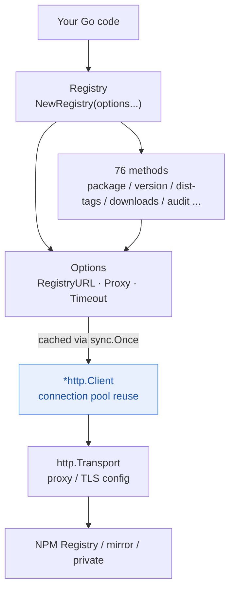
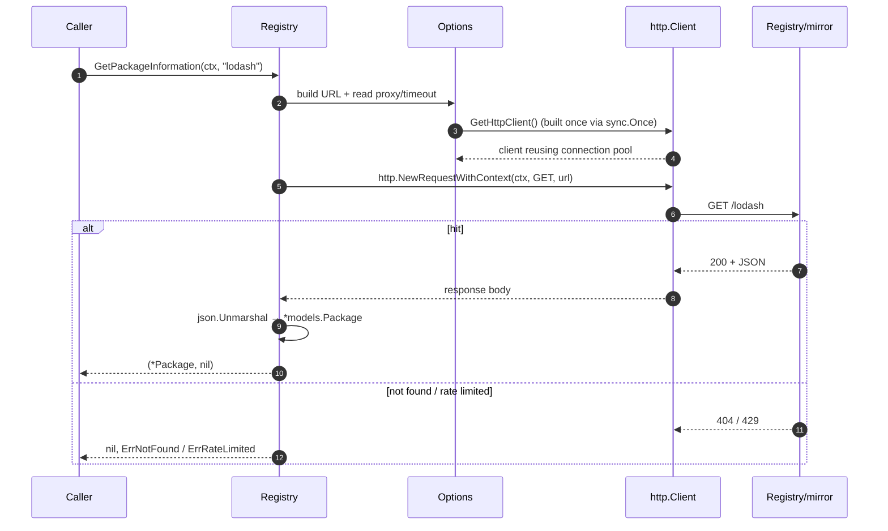
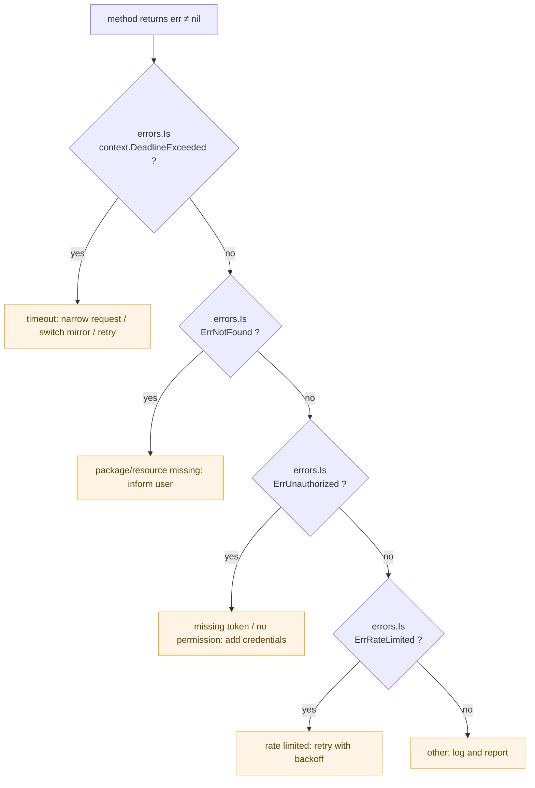

# Registry Client API

The Registry client is the main interface for interacting with NPM registries. This document provides comprehensive API reference for all available methods.

## Component Architecture

A `Registry` holds an `Options`, which lazily builds and caches an `*http.Client` via `sync.Once`, reusing the underlying TCP connection pool across requests:



## Request Lifecycle

Taking `GetPackageInformation` as an example — `context` flows through the whole call and can cancel or time out at any point:



## Registry Creation

### NewRegistry
```go
func NewRegistry(options ...*Options) *Registry
```

Creates a new registry client with optional configuration.

**Parameters:**
- `options` - Optional configuration options

**Returns:**
- `*Registry` - New registry client instance

**Example:**
```go
// Default client (uses official NPM registry)
client := registry.NewRegistry()

// With custom options
options := registry.NewOptions().SetRegistryURL("https://custom-registry.com")
client := registry.NewRegistry(options)
```

### Predefined Registry Clients

#### NewTaoBaoRegistry
```go
func NewTaoBaoRegistry(options ...*Options) *Registry
```

Creates a client configured for Taobao NPM mirror (China).

#### NewNpmMirrorRegistry
```go
func NewNpmMirrorRegistry(options ...*Options) *Registry
```

Creates a client configured for NPM mirror registry.

#### NewHuaWeiCloudRegistry
```go
func NewHuaWeiCloudRegistry(options ...*Options) *Registry
```

Creates a client configured for Huawei Cloud NPM mirror (China).

## Package Information Methods

### GetPackageInformation
```go
func (r *Registry) GetPackageInformation(ctx context.Context, packageName string) (*PackageInformation, error)
```

Retrieves comprehensive information about a package.

**Parameters:**
- `ctx` - Context for request cancellation and timeout
- `packageName` - Name of the NPM package

**Returns:**
- `*PackageInformation` - Package metadata including all versions
- `error` - Error if the request fails

**Example:**
```go
pkg, err := client.GetPackageInformation(ctx, "react")
if err != nil {
    return err
}

fmt.Printf("Package: %s\n", pkg.Name)
fmt.Printf("Latest: %s\n", pkg.DistTags["latest"])
fmt.Printf("Description: %s\n", pkg.Description)
```

### GetPackageVersion
```go
func (r *Registry) GetPackageVersion(ctx context.Context, packageName, version string) (*PackageVersion, error)
```

Retrieves information about a specific package version.

**Parameters:**
- `ctx` - Context for request cancellation and timeout
- `packageName` - Name of the NPM package
- `version` - Specific version to retrieve

**Returns:**
- `*PackageVersion` - Version-specific package information
- `error` - Error if the request fails

**Example:**
```go
version, err := client.GetPackageVersion(ctx, "react", "18.2.0")
if err != nil {
    return err
}

fmt.Printf("Version: %s\n", version.Version)
fmt.Printf("Dependencies: %d\n", len(version.Dependencies))
```

## Search Methods

### SearchPackages
```go
func (r *Registry) SearchPackages(ctx context.Context, query string, limit int) (*SearchResult, error)
```

Searches for packages matching the query.

**Parameters:**
- `ctx` - Context for request cancellation and timeout
- `query` - Search query string
- `limit` - Maximum number of results to return

**Returns:**
- `*SearchResult` - Search results with packages and metadata
- `error` - Error if the request fails

**Example:**
```go
results, err := client.SearchPackages(ctx, "react ui component", 10)
if err != nil {
    return err
}

fmt.Printf("Found %d results\n", results.Total)
for _, obj := range results.Objects {
    fmt.Printf("- %s: %s\n", obj.Package.Name, obj.Package.Description)
}
```

## Statistics Methods

### GetDownloadStats
```go
func (r *Registry) GetDownloadStats(ctx context.Context, packageName, period string) (*DownloadStats, error)
```

Retrieves download statistics for a package.

**Parameters:**
- `ctx` - Context for request cancellation and timeout
- `packageName` - Name of the NPM package
- `period` - Time period (`"last-day"`, `"last-week"`, `"last-month"`)

**Returns:**
- `*DownloadStats` - Download statistics
- `error` - Error if the request fails

**Example:**
```go
stats, err := client.GetDownloadStats(ctx, "react", "last-month")
if err != nil {
    return err
}

fmt.Printf("Downloads in last month: %d\n", stats.Downloads)
```

### DownloadTarball
```go
func (r *Registry) DownloadTarball(ctx context.Context, packageName, version, destPath string) error
```

Downloads an NPM package tarball to a local file path.

**Parameters:**
- `ctx` - Context for cancellation and timeout control
- `packageName` - Name of the package to download
- `version` - Version to download (e.g., "18.0.0" or "latest")
- `destPath` - Local file path where the tarball will be saved

**Returns:**
- `error` - Error if the download fails

**Example:**
```go
ctx := context.Background()

// Download specific version
err := client.DownloadTarball(ctx, "react", "18.0.0", "./react.tgz")
if err != nil {
    return fmt.Errorf("download failed: %w", err)
}

// Download latest version
err = client.DownloadTarball(ctx, "vue", "latest", "./vue.tgz")
if err != nil {
    return fmt.Errorf("download failed: %w", err)
}

// Verify the downloaded file
info, err := os.Stat("./react.tgz")
if err != nil {
    return err
}
fmt.Printf("File size: %d bytes\n", info.Size())
```

**Using CNPM mirror for faster downloads in China:**
```go
options := registry.NewOptions().SetRegistryURL(registry.RegistryUrlCnpm)
client := registry.NewRegistry(options)

err := client.DownloadTarball(ctx, "axios", "1.0.0", "/tmp/axios.tgz")
if err != nil {
    log.Fatalf("Download failed: %v", err)
}

fmt.Println("Download successful!")
```

## Registry Information Methods

### GetRegistryInformation
```go
func (r *Registry) GetRegistryInformation(ctx context.Context) (*RegistryInformation, error)
```

Retrieves information about the registry itself.

**Parameters:**
- `ctx` - Context for request cancellation and timeout

**Returns:**
- `*RegistryInformation` - Registry metadata and statistics
- `error` - Error if the request fails

**Example:**
```go
info, err := client.GetRegistryInformation(ctx)
if err != nil {
    return err
}

fmt.Printf("Registry: %s\n", info.DbName)
fmt.Printf("Total packages: %d\n", info.DocCount)
fmt.Printf("Data size: %d MB\n", info.DataSize/(1024*1024))
```

## Method Index (76 methods)

All 76 methods grouped by domain. `ctx` is always `context.Context`; 🔒 marks write operations that require a valid token configured on the server (`Options.Token`).

### Package Metadata (read-only)

| Method | Signature | Description |
|--------|-----------|-------------|
| `GetPackageInformation` | `(ctx, name) → *models.Package, error` | Full package metadata (can be 10MB+) |
| `GetPackageInformationSummary` | `(ctx, name) → *models.Package, error` | Lightweight summary (recommended) |
| `GetAbbreviatedPackageInformation` | `(ctx, name) → *models.Package, error` | Abbreviated metadata |
| `GetPackageVersion` | `(ctx, name, version) → *models.Version, error` | Specific version metadata |
| `GetPackageVersions` | `(ctx, name) → []string, error` | All version numbers |
| `GetPackageVersionCount` | `(ctx, name) → int, error` | Total version count |
| `GetPackageLatestVersion` | `(ctx, name) → string, error` | Latest version (dist-tags only) |

### dist-tags

| Method | Signature | Description |
|--------|-----------|-------------|
| `GetDistTags` | `(ctx, name) → map[string]string, error` | All dist-tags |
| `GetDistTagsAbbreviated` | `(ctx, name) → map[string]string, error` | Abbreviated dist-tags |
| `GetDistTag` | `(ctx, name, tag) → string, error` | Version a single tag points to |
| `SetDistTag` 🔒 | `(ctx, name, tag, version) → error` | Set a single dist-tag |
| `SetDistTags` 🔒 | `(ctx, name, tags) → error` | Set dist-tags in bulk |
| `DeleteDistTag` 🔒 | `(ctx, name, tag) → error` | Delete a dist-tag |

### Search

| Method | Signature | Description |
|--------|-----------|-------------|
| `SearchPackages` | `(ctx, query, limit) → *models.SearchResult, error` | Keyword search (paginated) |
| `SearchPackagesWithOptions` | `(ctx, query, opts SearchOptions) → *models.SearchResult, error` | Advanced search (weighting / offset) |

### Download Statistics (always queries `api.npmjs.org`)

| Method | Signature | Description |
|--------|-----------|-------------|
| `GetDownloadStats` | `(ctx, name, period) → *models.DownloadStats, error` | Download total for a period |
| `GetDownloadStatsByDateRange` | `(ctx, name, start, end) → *models.DownloadStats, error` | Custom date range |
| `GetDownloadRangeStats` | `(ctx, name, period) → *models.DownloadRangeStats, error` | Daily download trend |
| `GetDownloadRangeStatsByDateRange` | `(ctx, name, start, end) → *models.DownloadRangeStats, error` | Custom range daily trend |
| `GetBulkDownloadStats` | `(ctx, names []string, period) → map[string]*models.DownloadStats, error` | Bulk download totals |
| `GetBulkDownloadStatsByDateRange` | `(ctx, names, start, end) → map[string]*models.DownloadStats, error` | Bulk custom range |
| `GetBulkDownloadRangeStats` | `(ctx, names, period) → map[string]*models.DownloadRangeStats, error` | Bulk daily trend |
| `GetBulkDownloadRangeStatsByDateRange` | `(ctx, names, start, end) → map[string]*models.DownloadRangeStats, error` | Bulk custom range daily trend |

### Download Tarball

| Method | Signature | Description |
|--------|-----------|-------------|
| `DownloadTarball` | `(ctx, name, version, destPath) → error` | Download a tarball to a local path |

### Security Audit (read-only)

| Method | Signature | Description |
|--------|-----------|-------------|
| `QuickAudit` | `(ctx, payload *models.QuickAuditRequest) → *models.QuickAuditResult, error` | Quick audit (name→version) |
| `BulkAudit` | `(ctx, advisories map[string][]string) → map[string][]models.Advisory, error` | Bulk audit |
| `GetAdvisory` | `(ctx, advisoryID int) → *models.Advisory, error` | Get an advisory by ID |
| `ListAdvisories` | `(ctx, opts models.AdvisoryListOptions) → []models.Advisory, error` | Advisory list |

### Stars (read + write)

| Method | Signature | Description |
|--------|-----------|-------------|
| `GetStarredByPackage` | `(ctx, name) → []string, error` | Users who starred a package |
| `GetStarredByUser` | `(ctx, username) → []string, error` | Packages starred by a user |
| `StarPackage` 🔒 | `(ctx, name) → error` | Star a package |
| `UnstarPackage` 🔒 | `(ctx, name) → error` | Unstar a package |

### Access Control & Collaborators

| Method | Signature | Description |
|--------|-----------|-------------|
| `GetPackageAccess` 🔒 | `(ctx, name) → *models.PackageAccess, error` | Package access settings |
| `SetPackageAccess` 🔒 | `(ctx, name, access *models.PackageAccessUpdate) → error` | Update package access |
| `GrantAccess` 🔒 | `(ctx, name, user, permission) → error` | Grant collaborator permission |
| `RevokeAccess` 🔒 | `(ctx, name, user) → error` | Remove a collaborator |
| `ListCollaborators` 🔒 | `(ctx, name) → []models.Collaborator, error` | Collaborator list |

### Publish & Deprecate

| Method | Signature | Description |
|--------|-----------|-------------|
| `PublishPackage` 🔒 | `(ctx, pkg *models.Package) → error` | Publish a package |
| `PublishPackageFromTarball` 🔒 | `(ctx, name, version string, tarball []byte, meta *models.PublishMetadata) → error` | Publish from a tarball |
| `DeprecateVersion` 🔒 | `(ctx, name, version, message) → error` | Deprecate a version |
| `UnpublishPackage` 🔒 | `(ctx, name) → error` | Unpublish an entire package (dangerous) |
| `UnpublishPackageVersion` 🔒 | `(ctx, name, version) → error` | Unpublish a version |

### Token Management (require token)

| Method | Signature | Description |
|--------|-----------|-------------|
| `ListTokens` | `(ctx) → []models.Token, error` | Token list |
| `GetToken` | `(ctx, tokenID) → *models.Token, error` | Single token details |
| `CreateToken` 🔒 | `(ctx, opts *models.TokenCreation) → *models.Token, error` | Create a token |
| `DeleteToken` 🔒 | `(ctx, tokenID) → error` | Delete a token |

### Users & Auth

| Method | Signature | Description |
|--------|-----------|-------------|
| `WhoAmI` | `(ctx) → string, error` | Current authenticated username |
| `GetUser` 🔒 | `(ctx, name) → *models.UserProfile, error` | User profile |
| `Login` | `(ctx, name, password) → *models.LoginResult, error` | Log in |
| `CreateUser` | `(ctx, user *models.UserCreation) → *models.LoginResult, error` | Sign up |

### Orgs & Teams (require token)

| Method | Signature | Description |
|--------|-----------|-------------|
| `GetOrg` | `(ctx, orgName) → *models.Organization, error` | Organization details |
| `ListOrgMembers` | `(ctx, orgName) → []string, error` | Org members |
| `ListOrgPackages` | `(ctx, orgName) → []string, error` | Org packages |
| `CreateOrg` 🔒 | `(ctx, orgName) → *models.Organization, error` | Create an organization |
| `DeleteOrg` 🔒 | `(ctx, orgName) → error` | Delete an organization |
| `AddOrgMember` 🔒 | `(ctx, orgName, username) → error` | Add an org member |
| `RemoveOrgMember` 🔒 | `(ctx, orgName, username) → error` | Remove an org member |
| `ListTeams` | `(ctx, orgName) → []models.Team, error` | Team list |
| `ListTeamMembers` | `(ctx, orgName, teamName) → []string, error` | Team members |
| `ListTeamPackages` | `(ctx, orgName, teamName) → []string, error` | Team packages |
| `CreateTeam` 🔒 | `(ctx, orgName, teamName) → *models.Team, error` | Create a team |
| `DeleteTeam` 🔒 | `(ctx, orgName, teamName) → error` | Delete a team |
| `AddTeamMember` 🔒 | `(ctx, orgName, teamName, username) → error` | Add a team member |
| `RemoveTeamMember` 🔒 | `(ctx, orgName, teamName, username) → error` | Remove a team member |

### Webhooks (require token)

| Method | Signature | Description |
|--------|-----------|-------------|
| `ListHooks` | `(ctx, opts models.HookListOptions) → []models.Hook, error` | Webhook list |
| `GetHook` | `(ctx, hookID) → *models.Hook, error` | Webhook details |
| `CreateHook` 🔒 | `(ctx, hook *models.HookCreation) → *models.Hook, error` | Create a webhook |
| `UpdateHook` 🔒 | `(ctx, hookID, hook *models.HookUpdate) → *models.Hook, error` | Update a webhook |
| `DeleteHook` 🔒 | `(ctx, hookID) → error` | Delete a webhook |

### CouchDB Views & Changes Feed (advanced — for mirroring / incremental sync)

| Method | Signature | Description |
|--------|-----------|-------------|
| `GetRegistryInformation` | `(ctx) → *models.RegistryInformation, error` | Registry status and stats |
| `RegistryHealthCheck` | `(ctx) → bool, error` | Registry health check |
| `IsPrivateRegistry` | `() → bool` | Whether it's a private registry |
| `GetChanges` | `(ctx, opts models.ChangesOptions) → *models.ChangesResult, error` | Changes feed |
| `GetAllDocs` | `(ctx, opts models.AllDocsOptions) → *models.AllDocsResult, error` | All documents |
| `GetView` | `(ctx, viewName, opts models.ViewOptions) → *models.ViewResult, error` | View query |

### Configuration

| Method | Signature | Description |
|--------|-----------|-------------|
| `GetOptions` | `() → *Options` | Current configuration options |

## Error Handling

All methods return errors that can be handled using standard Go error handling patterns. The SDK exposes typed sentinel errors you can branch on with `errors.Is()`:



```go
pkg, err := client.GetPackageInformation(ctx, "nonexistent-package")
if err != nil {
    switch {
    case errors.Is(err, context.DeadlineExceeded):
        log.Println("Request timeout")
    case errors.Is(err, context.Canceled):
        log.Println("Request canceled")
    default:
        log.Printf("API error: %v", err)
    }
    return
}
```

## Context Usage

All methods accept a `context.Context` parameter for:

### Timeout Control
```go
ctx, cancel := context.WithTimeout(context.Background(), 10*time.Second)
defer cancel()

pkg, err := client.GetPackageInformation(ctx, "react")
```

### Request Cancellation
```go
ctx, cancel := context.WithCancel(context.Background())

// Cancel request from another goroutine
go func() {
    time.Sleep(5 * time.Second)
    cancel()
}()

pkg, err := client.GetPackageInformation(ctx, "react")
```

### Request Values
```go
ctx := context.WithValue(context.Background(), "request-id", "12345")
pkg, err := client.GetPackageInformation(ctx, "react")
```

## Best Practices

### 1. Always Use Context
```go
// Good
ctx := context.Background()
pkg, err := client.GetPackageInformation(ctx, "react")

// Better - with timeout
ctx, cancel := context.WithTimeout(context.Background(), 30*time.Second)
defer cancel()
pkg, err := client.GetPackageInformation(ctx, "react")
```

### 2. Handle Errors Appropriately
```go
pkg, err := client.GetPackageInformation(ctx, packageName)
if err != nil {
    // Log the error with context
    log.Printf("Failed to get package %s: %v", packageName, err)
    return fmt.Errorf("package lookup failed: %w", err)
}
```

### 3. Reuse Client Instances
```go
// Good - reuse client
client := registry.NewRegistry()
for _, pkg := range packages {
    info, err := client.GetPackageInformation(ctx, pkg)
    // Process info...
}

// Avoid - creating new clients
for _, pkg := range packages {
    client := registry.NewRegistry() // Wasteful
    info, err := client.GetPackageInformation(ctx, pkg)
}
```

### 4. Use Appropriate Timeouts
```go
// Short timeout for quick operations
ctx, cancel := context.WithTimeout(context.Background(), 5*time.Second)
defer cancel()

// Longer timeout for search operations
ctx, cancel := context.WithTimeout(context.Background(), 30*time.Second)
defer cancel()
```

## Next Steps

- Review [Data Models](models.md) for detailed structure information
- Check [Configuration Options](configuration.md) for client customization
- Explore [Examples](../examples/) for practical usage patterns