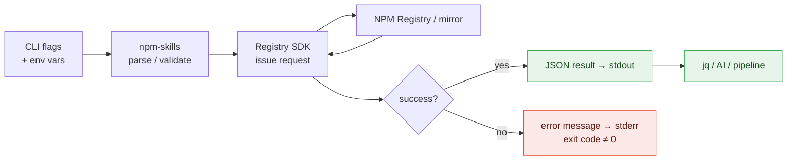
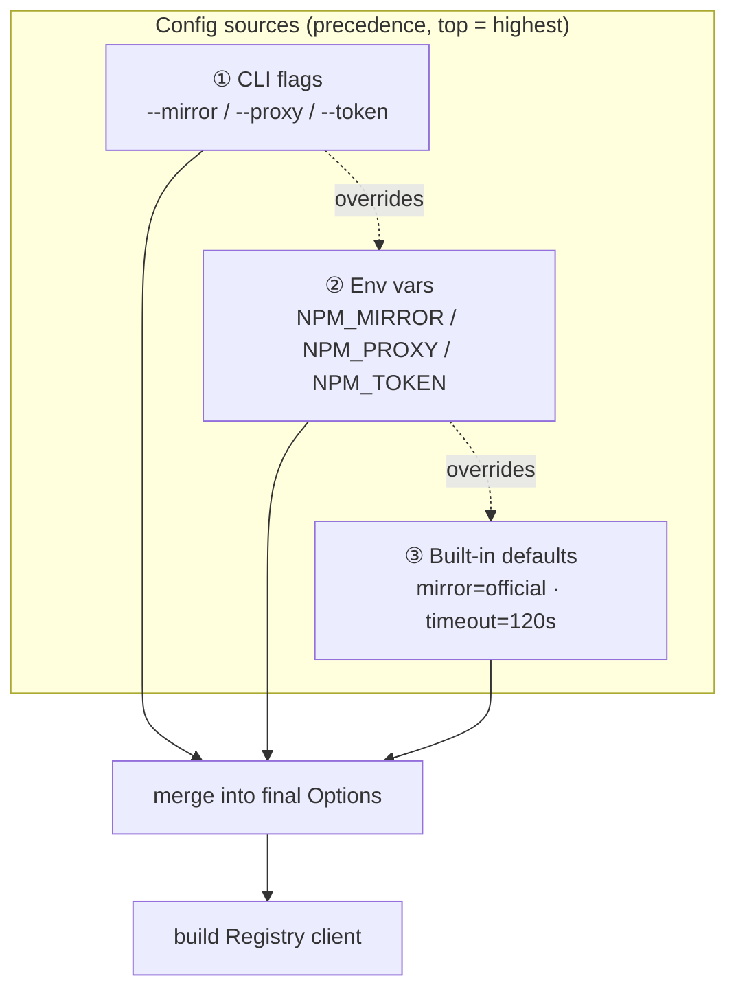
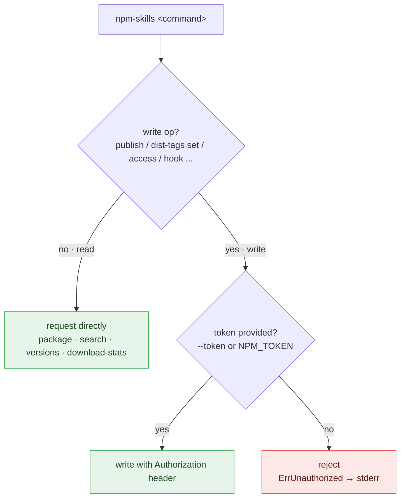
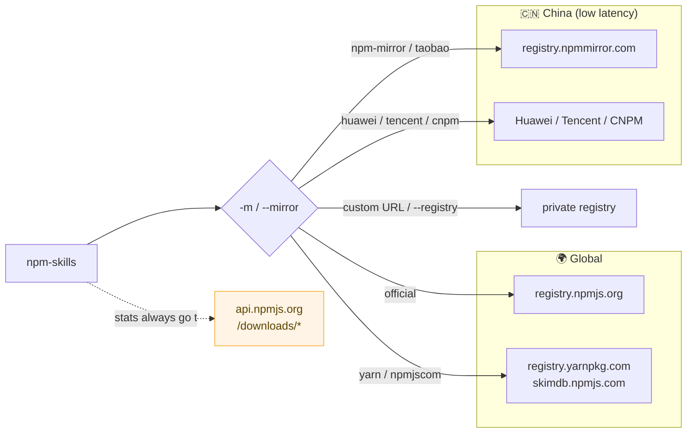

# CLI Reference

The `npm-skills` CLI has 26 commands. All output JSON to stdout (easy for AI to parse); status messages go to stderr.

This "data on stdout, logs on stderr" split lets the CLI be both human-readable and pipeable by scripts and AI via tools like `jq`:



## Global Flags

| Flag | Short | Default | Description |
|------|-------|---------|-------------|
| `--mirror` | `-m` | `official` | Mirror source name |
| `--registry` | | | Custom registry URL (overrides --mirror) |
| `--token` | `-t` | | NPM auth token (write ops, env: `NPM_TOKEN`) |
| `--proxy` | | | HTTP proxy URL (env: `NPM_PROXY`) |
| `--timeout` | | `120` | Request timeout in seconds |

**Priority**: CLI flag > Environment variable > Default



Commands split into two classes by whether auth is required — reads are anonymous, writes require `--token`:



## Read Operations

### Package Info

```bash
npm-skills package-summary <name>     # Lightweight (recommended)
npm-skills package <name>             # Full metadata (can be 10MB+)
npm-skills pkg-version <name> <ver>   # Specific version
npm-skills versions <name>            # All versions
npm-skills versions <name> --latest   # Latest only
```

> **Tip**: Prefer `package-summary` — much smaller and faster.

### Search

```bash
npm-skills search <query>                  # Basic
npm-skills search <query> -l 10            # Limit
npm-skills search <query> --from 20 -l 10  # Paginated
npm-skills search <query> --popularity 1.0 # Weight by popularity
```

| Flag | Short | Default | Description |
|------|-------|---------|-------------|
| `--limit` | `-l` | 20 | Max results |
| `--from` | | 0 | Pagination offset |
| `--quality` | | 0 | Quality weight (0-1) |
| `--popularity` | | 0 | Popularity weight (0-1) |
| `--maintenance` | | 0 | Maintenance weight (0-1) |

### Dist-Tags (read)

```bash
npm-skills dist-tags get <name>
```

### Download Stats

```bash
npm-skills download-stats <name> -p last-month          # Single package
npm-skills download-range <name> -p last-week           # Daily trend
npm-skills download-stats-date <name> --start 2024-01-01 --end 2024-06-30
npm-skills download-stats-bulk react,vue,angular -p last-month  # Bulk (≤128)
```

> Download stats always query api.npmjs.org regardless of mirror/registry.

### Other Read Commands

```bash
npm-skills registry-info
npm-skills mirrors
npm-skills config
npm-skills whoami --token <token>
npm-skills download <name> <ver> <dest>
```

## Write Operations (require --token)

All write operations need auth. Use `--token` or set `NPM_TOKEN`.

### Publish / Unpublish / Deprecate

```bash
npm-skills publish ./pkg.tgz --name my-pkg --version 1.0.0 -t <token>
npm-skills deprecate my-pkg 1.0.0 -M "Use v2.0.0" -t <token>
npm-skills unpublish my-pkg --version 1.0.0 -t <token>   # dangerous
npm-skills unpublish my-pkg --force -t <token>           # very dangerous
```

::: danger unpublish is irreversible
`unpublish` permanently removes a published version from the registry, which can break the builds of every project that depends on it. npm enforces [strict time and eligibility limits](https://docs.npmjs.com/policies/unpublish) on unpublish (generally only within 72 hours of publishing). `--force` skips the interactive confirmation, so double-check the package name and version first. In most cases prefer `deprecate` to flag a version rather than deleting it.
:::

### Dist-Tags Management

```bash
npm-skills dist-tags set <name> <tag> --version <ver> -t <token>
npm-skills dist-tags delete <name> <tag> -t <token>
```

### Access & Collaborators

```bash
npm-skills access get <name> -t <token>
npm-skills access set <name> --visibility public -t <token>
npm-skills access collaborators <name> -t <token>
npm-skills access grant <name> <user> --permission read -t <token>
npm-skills access revoke <name> <user> -t <token>
```

### Stars

```bash
npm-skills star add <name> -t <token>
npm-skills star remove <name> -t <token>
npm-skills star list <username>
npm-skills star stargazers <name>
```

### Token Management

```bash
npm-skills token list -t <token>
npm-skills token get <id> -t <token>
npm-skills token create --password <pass> -t <token>
npm-skills token delete <id> -t <token>
```

### Security Audit

```bash
npm-skills audit quick --deps "lodash=4.17.11,express=4.17.1"
npm-skills audit bulk --advisories "lodash=<4.17.12"
npm-skills audit advisory 123
npm-skills audit advisories --package lodash
```

### Orgs & Teams

```bash
npm-skills org get <org> -t <token>
npm-skills org members <org> -t <token>
npm-skills org packages <org> -t <token>
npm-skills org team-list <org> -t <token>
npm-skills org team-members <org> <team> -t <token>
```

### Webhooks

```bash
npm-skills hook list -t <token>
npm-skills hook get <id> -t <token>
npm-skills hook create --name my-hook --endpoint https://... -t <token>
npm-skills hook update <id> --endpoint https://new... -t <token>
npm-skills hook delete <id> -t <token>
```

## Mirror Sources

| Mirror | Name | Region |
|--------|------|--------|
| `https://registry.npmjs.org` | `official` | Global |
| `https://registry.npmmirror.com` | `npm-mirror` | China (recommended) |
| `https://registry.npm.taobao.org` | `taobao` | China |
| `https://mirrors.huaweicloud.com/repository/npm` | `huawei` | China |
| `http://mirrors.cloud.tencent.com/npm` | `tencent` | China |
| `http://r.cnpmjs.org` | `cnpm` | China |
| `https://registry.yarnpkg.com` | `yarn` | Global |
| `https://skimdb.npmjs.com` | `npmjscom` | Global |

Pass any URL directly: `--mirror https://your-registry.com`

Mirror selection routes package metadata/downloads to the chosen mirror, while **download stats always go to `api.npmjs.org`** (mirrors don't serve that endpoint):



::: tip Recommendation
China users: prefer `npm-mirror` (`registry.npmmirror.com`) for the fastest speed without a proxy. On restricted networks, use the official source with `--proxy`. For enterprise intranets, point `--registry` at your private registry.
:::

## Next Steps

- Read [Getting Started](/en/getting-started) for the four entry points
- Check [MCP Server](/en/mcp-server) to expose commands as AI tools
- Browse [API docs](/en/api/) for the underlying SDK methods
