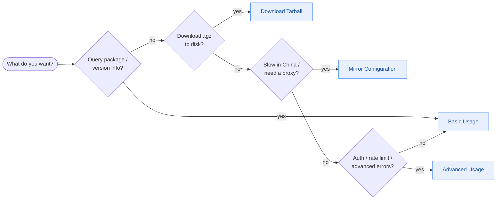

# Examples

Practical usage patterns for the NPM Skills Go SDK.

- [Basic Usage](/en/examples/basic) — Create a client, query packages, search
- [Advanced Usage](/en/examples/advanced) — Custom registries, auth, timeout, error handling
- [Mirror Configuration](/en/examples/mirrors) — China mirrors and proxy setup
- [Download Tarball](/en/examples/download) — Download .tgz files to disk
