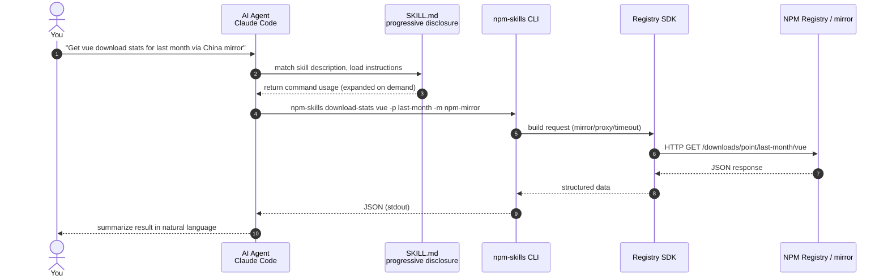
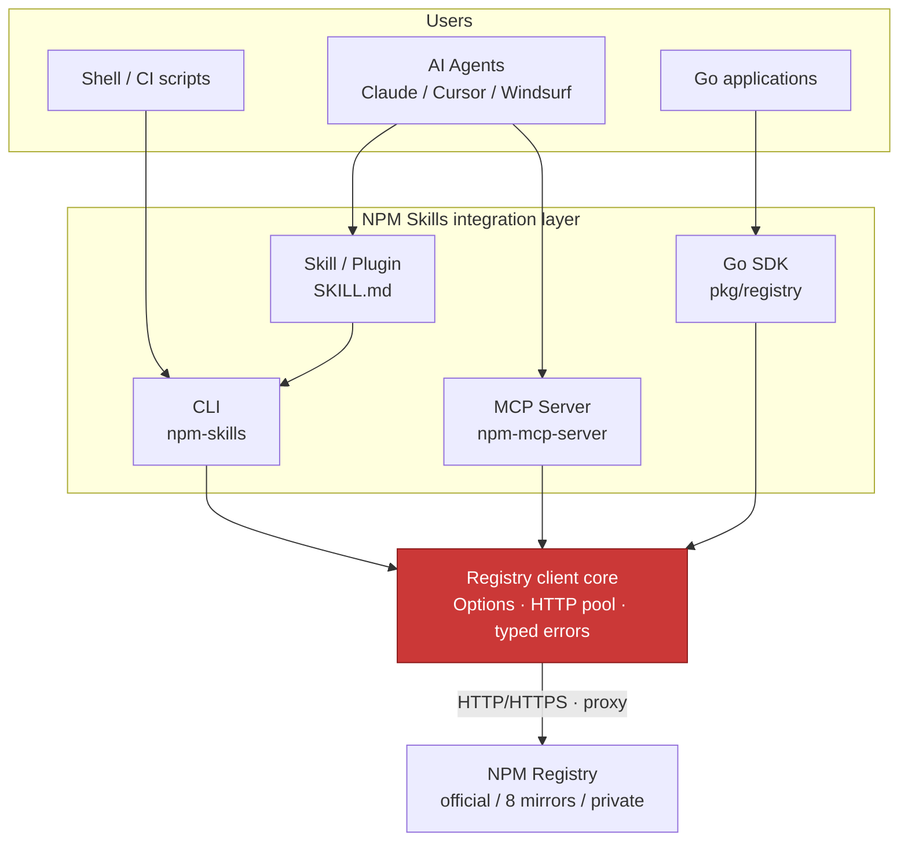
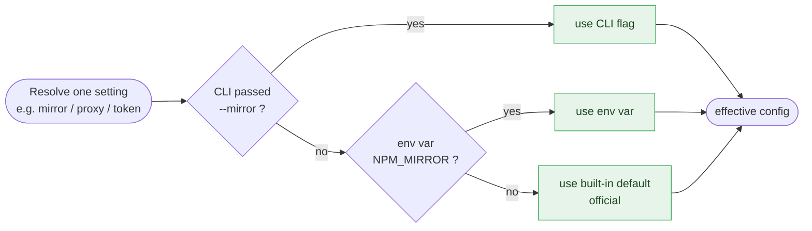

# Getting Started

## Install as Claude Code Plugin in 1 minute

```bash
claude plugin marketplace add scagogogo/npm-skills
claude plugin install npm@npm-skills
```

Then ask in natural language — the AI agent auto-invokes NPM Skills:

> *"Find info about the axios package"*
> *"Download the react tarball"*
> *"Get vue download stats for last month via the China mirror"*

The full call chain from natural language to the NPM Registry:



## Four Ways to Integrate

All four entry points share one Registry SDK core and converge on the NPM Registry or a mirror:



| Way | Use case | Entry |
|-----|----------|-------|
| **Skill / Plugin** | AI agents auto-invoke | `claude plugin install npm@npm-skills` |
| **CLI Tool** | Shell / scripts | `npm-skills <command>` |
| **Go SDK** | Go programs | `import "github.com/scagogogo/npm-skills/pkg/registry"` |
| **MCP Server** | MCP-compatible clients | `npm-mcp-server` |

## CLI Cheat Sheet (90% of cases)

```bash
npm-skills package-summary react            # Lightweight info (recommended)
npm-skills search "http client" -l 10
npm-skills versions react --latest
npm-skills dist-tags get react
npm-skills download-stats react -p last-month
npm-skills mirrors
npm-skills package react -m npm-mirror      # China mirror
```

## Mirrors & Proxy

```bash
npm-skills package react -m npm-mirror                       # China mirror
npm-skills package react --proxy http://127.0.0.1:7890       # HTTP proxy
npm-skills package my-lib --registry https://npm.co.com -t npm_x  # Private

export NPM_MIRROR=npm-mirror
export NPM_PROXY=http://127.0.0.1:7890
export NPM_TOKEN=npm_xxxxx
```

When the same setting is specified in multiple places, precedence is "CLI flag > env var > default":



## Next Steps

- [CLI Reference](/en/cli) — All 26 commands
- [Go SDK](/en/api/registry) — Programmatic access
- [MCP Server](/en/mcp-server) — AI tool chain integration
