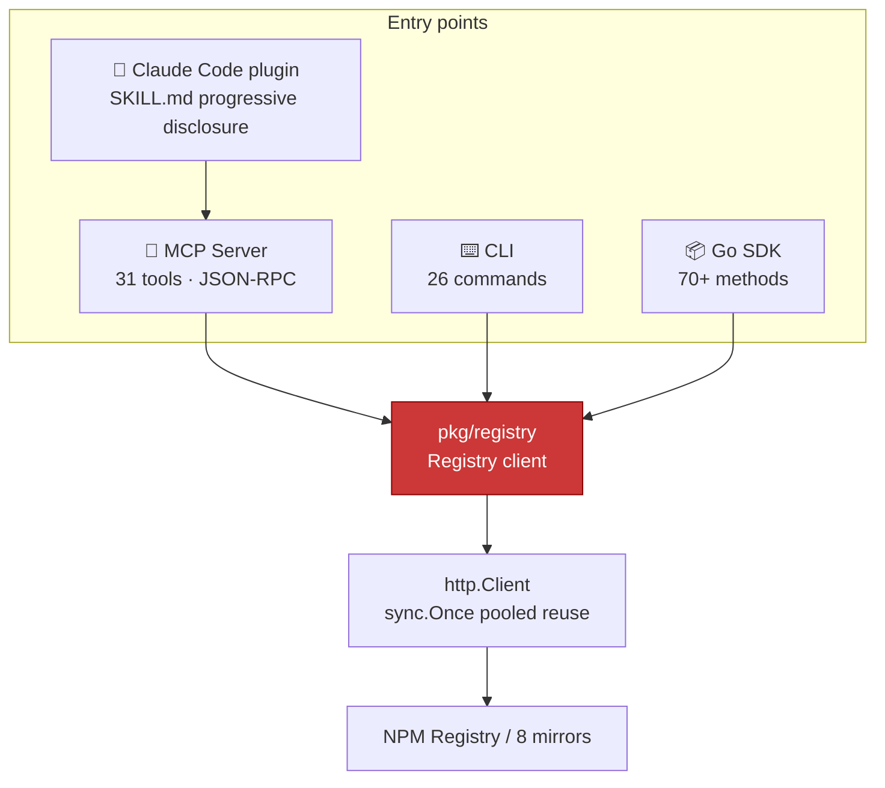

## 📋 One-Click Copy for AI Agents

Copy the prompt below and paste it into your AI agent (Claude Code, Cursor, Windsurf, ChatGPT, etc.). The agent will follow the instructions to install and use NPM Skills automatically — no need to explain commands line by line.

::: tip How to copy
Click the **Copy** button at the top-right of the code block, paste into your AI agent's chat, and it will handle installation, verification, and NPM tasks.
:::

````md
---
title: Use NPM Skills to operate on the NPM Registry
---

# Your Task

You now have access to **NPM Skills** — a complete NPM Registry client supporting package query, version management, dist-tags, download stats, publishing, access control, security audit, org/team, webhooks, etc. Includes 8 mirrors (China: no proxy needed) and HTTP/SOCKS5 proxy support.

## Step 1: Install (pick one based on your environment; option 1 recommended)

### Option 1: Claude Code plugin (AI-native, recommended)
```bash
claude plugin marketplace add scagogogo/npm-skills
claude plugin install npm@npm-skills
```
After install, you (AI) auto-discover SKILL.md and invoke on demand — no manual shell needed.

### Option 2: Download prebuilt binary (without Claude Code)
```bash
# Linux x86_64
curl -sL https://github.com/scagogogo/npm-skills/releases/latest/download/npm-skills_0.2.0_linux_x86_64.tar.gz | tar -xz
sudo mv npm-skills npm-mcp-server /usr/local/bin/
# macOS Apple Silicon: replace linux_x86_64 with aarch64; Windows: use .zip
```

### Option 3: Build from source
```bash
bash scripts/install.sh   # Compiles to ~/.local/bin/
```

### Option 4: go install
```bash
go install github.com/scagogogo/npm-skills/cmd/npm-skills@latest
go install github.com/scagogogo/npm-skills/cmd/mcp-server@latest
```

## Step 2: Verify installation
```bash
npm-skills --version
npm-skills mirrors          # List 8 mirror sources
```

## Step 3: Common commands cheat sheet (90% of cases)

### Get package info
```bash
npm-skills package-summary <name>        # Lightweight (recommended, KB response)
npm-skills package <name>                # Full metadata (can be 10MB+)
npm-skills versions <name> --latest      # Latest version
npm-skills pkg-version <name> <ver>      # Specific version details
```

### Search and stats
```bash
npm-skills search "<query>" -l 10                  # Search packages
npm-skills download-stats <name> -p last-month    # Download count
npm-skills download-range <name> -p last-week     # Daily trend
npm-skills download-stats-bulk react,vue -p last-month  # Bulk compare
```

### Mirrors and proxy (China users: key section)
```bash
npm-skills package react -m npm-mirror                              # China mirror, no proxy
npm-skills package react --proxy http://127.0.0.1:7890              # HTTP proxy
npm-skills package my-lib --registry https://npm.my-company.com     # Private registry
```
Env vars: `NPM_MIRROR=npm-mirror`, `NPM_PROXY=...`, `NPM_TOKEN=...`

### Write operations (require token)
```bash
npm-skills publish ./pkg.tgz --name my-pkg --version 1.0.0 -t npm_xxxxx
npm-skills deprecate my-pkg 1.0.0 -M "Use v2.0.0" -t npm_xxxxx
npm-skills dist-tags set my-pkg next --version 2.0.0-rc.1 -t npm_xxxxx
npm-skills access get my-pkg -t npm_xxxxx
npm-skills audit quick --deps "lodash=4.17.11,express=4.17.1"
```

## Key rules
1. **All commands output JSON to stdout**; status/info goes to stderr — parse with `jq`.
2. **Read ops = no auth**; write ops need `--token` or `NPM_TOKEN`. Verify with `whoami`.
3. **Prefer `package-summary`** over `package` — smaller, faster.
4. **Download stats always query api.npmjs.org** regardless of mirror.
5. China users: default to `-m npm-mirror`; restricted networks: add `--proxy`; private registries: `--registry`.
6. Typed errors: `ErrNotFound`/`ErrUnauthorized`/`ErrRateLimited` for programmatic handling.

## When the user asks for NPM-related tasks
Pick the matching command and run:
- "Check axios info" → `npm-skills package-summary axios`
- "React downloads last month" → `npm-skills download-stats react -p last-month`
- "Query vue via China mirror" → `npm-skills package vue -m npm-mirror`
- "Publish my package" → `npm-skills publish ... -t $NPM_TOKEN`
- "Audit dependencies" → `npm-skills audit quick --deps "..."`

Full 26 commands: `npm-skills --help`. SDK docs: https://scagogogo.github.io/npm-skills/en/api/
````

## Four entry points, one core

NPM Skills exposes the same Registry capabilities through four entry points — pick whichever fits your scenario. They all share a single connection-pooled Go client underneath:



## 30-second start

::: code-group

```bash [CLI]
# Query package info
npm-skills package-summary react

# Search and limit results
npm-skills search "web framework" --limit 10

# Download a tarball via a mirror
npm-skills download lodash 4.17.21 ./ --registry https://registry.npmmirror.com
```

```go [Go SDK]
package main

import (
    "context"
    "fmt"

    "github.com/scagogogo/npm-skills/pkg/registry"
)

func main() {
    client := registry.NewRegistry()
    pkg, err := client.GetPackageInformation(context.Background(), "react")
    if err != nil {
        panic(err)
    }
    fmt.Println("Latest version:", pkg.DistTags["latest"])
}
```

:::

Ready to go deeper? Head to [Getting Started](/en/getting-started) for the full setup of all four entry points, or jump straight to the [API docs](/en/api/) and [CLI reference](/en/cli).
