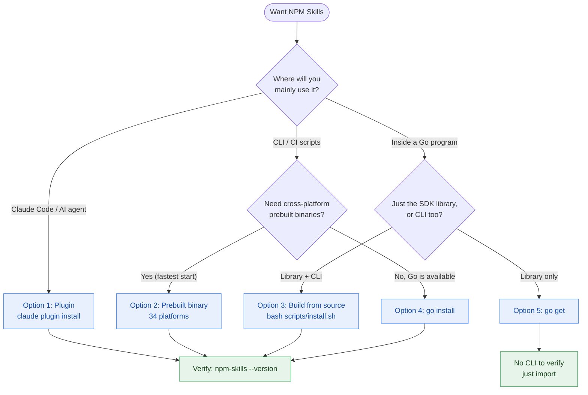

# Installation

Five installation methods exist — pick by use case rather than trying all. Use the decision diagram below to find the one that fits:



## Option 1: Claude Code Plugin (recommended for AI agents)

```bash
claude plugin marketplace add scagogogo/npm-skills
claude plugin install npm@npm-skills
```

## Option 2: Pre-built Binary (recommended for CLI)


Download the archive for your platform from [GitHub Releases](https://github.com/scagogogo/npm-skills/releases/latest):

```bash
# Linux x86_64
curl -sL https://github.com/scagogogo/npm-skills/releases/latest/download/npm-skills_0.2.0_linux_x86_64.tar.gz | tar -xz
sudo mv npm-skills npm-mcp-server /usr/local/bin/

# macOS Apple Silicon
curl -sL https://github.com/scagogogo/npm-skills/releases/latest/download/npm-skills_0.2.0_aarch64.tar.gz | tar -xz
sudo mv npm-skills npm-mcp-server /usr/local/bin/

# Windows (PowerShell)
Invoke-WebRequest -Uri "https://github.com/scagogogo/npm-skills/releases/latest/download/npm-skills_0.2.0_windows_x86_64.zip" -OutFile "npm-skills.zip"
Expand-Archive npm-skills.zip
```

### Supported Platforms (34 combinations)

| OS | Architectures |
|----|---------------|
| Linux | amd64, arm64, 386, arm, loong64, mips, mips64, mips64le, mipsle, ppc64, ppc64le, riscv64, s390x |
| macOS | amd64, arm64 |
| Windows | amd64, 386 |
| FreeBSD | amd64, arm64, 386, arm, mips, mipsle, ppc64, ppc64le |
| OpenBSD | amd64, arm64, 386, arm, mips, mipsle, ppc64, ppc64le |
| NetBSD | amd64, arm64, 386, arm, mips, mipsle, ppc64, ppc64le |
| Illumos | amd64 |
| Solaris | amd64 |

## Option 3: Build from Source

```bash
git clone https://github.com/scagogogo/npm-skills.git
cd npm-skills
bash scripts/install.sh   # builds to ~/.local/bin/
```

## Option 4: go install

```bash
go install github.com/scagogogo/npm-skills/cmd/npm-skills@latest
go install github.com/scagogogo/npm-skills/cmd/mcp-server@latest
```

## Option 5: Go Module

```bash
go get github.com/scagogogo/npm-skills
```

## Verify

```bash
npm-skills --version
npm-skills mirrors
```

## Next Steps

- Read [Getting Started](/en/getting-started) for the four entry points
- Check the [CLI Reference](/en/cli) for all 26 commands
- Browse [API docs](/en/api/) for the underlying SDK methods
