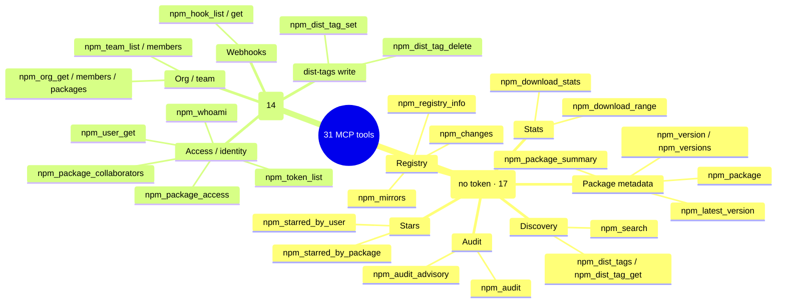

# MCP Server

NPM Skills ships an MCP (Model Context Protocol) server that exposes NPM Registry operations as 31 tools, callable from any MCP-compatible AI client — Claude Code, Cursor, Windsurf, and more.

## Architecture

The client and server talk over JSON-RPC (stdio transport); the server translates each tool call into a Registry SDK method call:


Full sequence of a single tool call (querying a package summary):


## Install

```bash
# Build from source (builds both CLI and MCP server)
bash scripts/install.sh

# Or go install (produces a binary named mcp-server, from the dir name)
go install github.com/scagogogo/npm-skills/cmd/mcp-server@latest
```

> **Note**: `go install` produces an executable named `mcp-server` (from the `cmd/mcp-server` directory name); the prebuilt binary from the Releases page is named `npm-mcp-server`. The config examples below use `npm-mcp-server` — if you installed via `go install`, change `command` to `mcp-server`.

## Configuration

### Claude Code

```json
{
  "mcpServers": {
    "npm-registry": {
      "command": "npm-mcp-server",
      "args": ["--mirror", "npm-mirror"]
    }
  }
}
```

### Cursor / Generic MCP Client

```json
{
  "mcpServers": {
    "npm-registry": {
      "command": "npm-mcp-server",
      "args": ["--token", "npm_xxxxx", "--proxy", "http://127.0.0.1:7890"]
    }
  }
}
```

## Flags

| Flag | Default | Description |
|------|---------|-------------|
| `--mirror` | `official` | Mirror source name (env: `NPM_MIRROR`) |
| `--registry` | | Custom registry URL (env: `NPM_REGISTRY`) |
| `--token` | | Auth token (env: `NPM_TOKEN`) |
| `--proxy` | | HTTP proxy (env: `NPM_PROXY`) |
| `--timeout` | `120` | Timeout in seconds (env: `NPM_TIMEOUT`) |

## Tools (31)

The 31 tools split by whether they need a token: 17 read-only tools need no auth, 14 require a valid token configured on the server (`--token` or `NPM_TOKEN`):



### Read Tools (no token)

| Tool | Description |
|------|-------------|
| `npm_registry_info` | Registry status and stats (package count, disk size, etc.) |
| `npm_mirrors` | List all mirror sources with URLs, regions, descriptions |
| `npm_package` | Full package metadata (can be 10MB+; prefer summary) |
| `npm_package_summary` | Lightweight package metadata (name, description, dist-tags, versions) — recommended |
| `npm_search` | Search packages by keyword (pagination, score weighting) |
| `npm_version` | Metadata for a specific version (deps, scripts, dist) |
| `npm_versions` | All published version numbers (ascending) |
| `npm_latest_version` | Latest version number (dist-tags only; fast) |
| `npm_dist_tags` | All dist-tags (latest / next / beta …) |
| `npm_dist_tag_get` | Version a single dist-tag points to |
| `npm_download_stats` | Download total for a period (always queries api.npmjs.org) |
| `npm_download_range` | Daily download trend array (always queries api.npmjs.org) |
| `npm_audit` | Quick security audit (submit name→version map, get vuln counts by severity) |
| `npm_audit_advisory` | Get a single security advisory by ID |
| `npm_starred_by_package` | Users who starred a package |
| `npm_starred_by_user` | Packages starred by a user |
| `npm_changes` | Registry changes feed (for mirroring / incremental sync) |

### Token-Required Tools

| Tool | Description |
|------|-------------|
| `npm_dist_tag_set` | Set/update a dist-tag to a version |
| `npm_dist_tag_delete` | Delete a dist-tag (deleting `latest` is risky) |
| `npm_package_access` | Package access/permission settings |
| `npm_package_collaborators` | Package collaborators |
| `npm_user_get` | User profile info |
| `npm_whoami` | Current auth status (returns username) |
| `npm_token_list` | API token list for the current user |
| `npm_org_get` | Organization details |
| `npm_org_members` | Organization members |
| `npm_org_packages` | Packages owned by an organization |
| `npm_team_list` | Teams in an organization |
| `npm_team_members` | Team members |
| `npm_hook_list` | Webhook list for the current user |
| `npm_hook_get` | Single webhook details |

## Next Steps

- Read [Getting Started](/en/getting-started) to install and configure
- Check the [CLI Reference](/en/cli) for equivalent command-line usage
- Browse [API docs](/en/api/) for the underlying SDK methods
