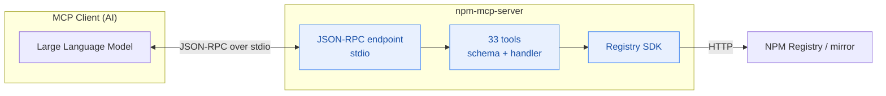
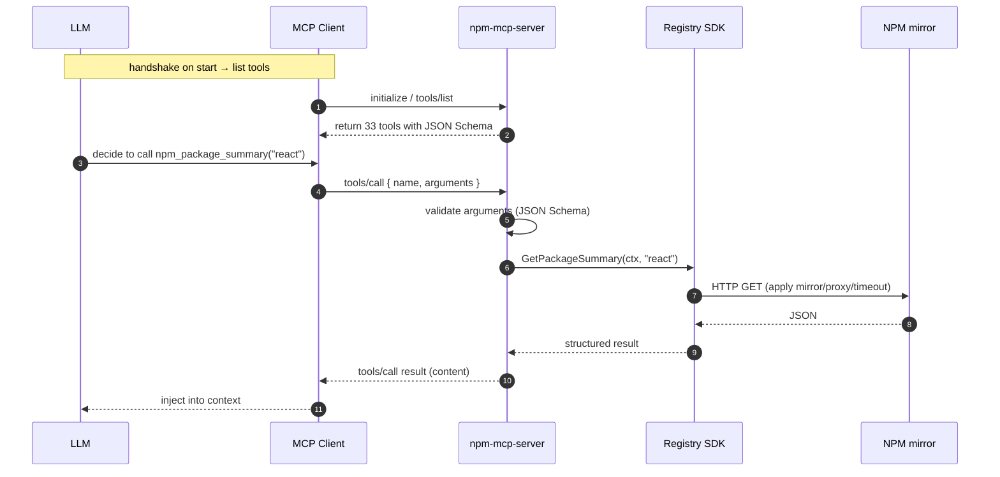
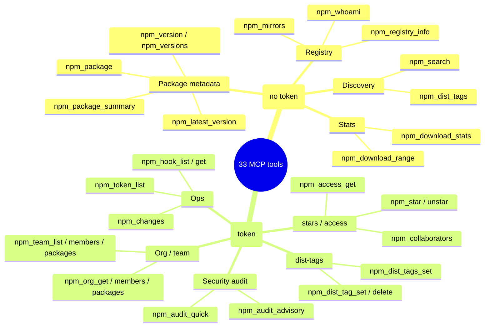

# MCP Server

NPM Skills ships an MCP (Model Context Protocol) server that exposes NPM Registry operations as 33 tools, callable from any MCP-compatible AI client — Claude Code, Cursor, Windsurf, and more.

## Architecture

The client and server talk over JSON-RPC (stdio transport); the server translates each tool call into a Registry SDK method call:



Full sequence of a single tool call (querying a package summary):



## Install

```bash
# Build from source (builds both CLI and MCP server)
bash scripts/install.sh

# Or go install
go install github.com/scagogogo/npm-skills/cmd/mcp-server@latest
```

## Configuration

### Claude Code

```json
{
  "mcpServers": {
    "npm-registry": {
      "command": "npm-mcp-server",
      "args": ["--mirror", "npm-mirror"]
    }
  }
}
```

### Cursor / Generic MCP Client

```json
{
  "mcpServers": {
    "npm-registry": {
      "command": "npm-mcp-server",
      "args": ["--token", "npm_xxxxx", "--proxy", "http://127.0.0.1:7890"]
    }
  }
}
```

## Flags

| Flag | Default | Description |
|------|---------|-------------|
| `--mirror` | `official` | Mirror source name |
| `--registry` | | Custom registry URL |
| `--token` | | Auth token (env: `NPM_TOKEN`) |
| `--proxy` | | HTTP proxy (env: `NPM_PROXY`) |
| `--timeout` | `120` | Timeout in seconds |

## Tools (33)

The 33 tools group into read and write classes across several domains. Write tools require a valid token:



### Read Tools

| Tool | Description |
|------|-------------|
| `npm_registry_info` | Registry status and stats |
| `npm_mirrors` | Mirror source list |
| `npm_package` | Full package metadata (large) |
| `npm_package_summary` | Lightweight package metadata (recommended) |
| `npm_search` | Search packages (pagination, weighting) |
| `npm_version` | Specific version metadata |
| `npm_versions` | All version numbers |
| `npm_latest_version` | Latest version number |
| `npm_dist_tags` | Distribution tags |
| `npm_download_stats` | Download count for a period |
| `npm_download_range` | Daily download trend |
| `npm_whoami` | Auth status |

### Write Tools (require token)

| Tool | Description |
|------|-------------|
| `npm_dist_tag_set` | Set a dist-tag |
| `npm_dist_tag_delete` | Delete a dist-tag |
| `npm_dist_tags_set` | Batch set dist-tags |
| `npm_star` | Star a package |
| `npm_unstar` | Unstar a package |
| `npm_stargazers` | Stargazers of a package |
| `npm_starred_by_user` | Packages starred by a user |
| `npm_access_get` | Package access settings |
| `npm_collaborators` | Package collaborators |
| `npm_token_list` | API token list |
| `npm_audit_quick` | Quick security audit |
| `npm_audit_advisory` | Security advisory by ID |
| `npm_hook_list` | Webhook list |
| `npm_hook_get` | Webhook details |
| `npm_org_get` | Organization info |
| `npm_org_members` | Org members |
| `npm_org_packages` | Org packages |
| `npm_team_list` | Team list |
| `npm_team_members` | Team members |
| `npm_team_packages` | Team packages |
| `npm_changes` | Registry changes feed |
