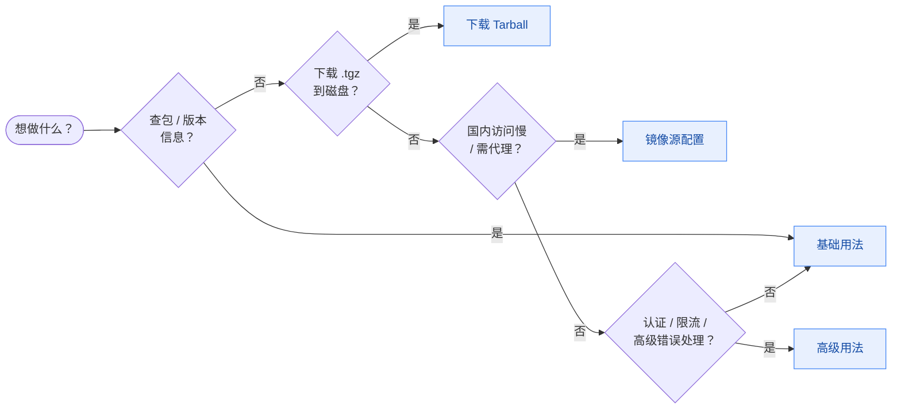

# 示例

NPM Skills Go SDK 的实用模式。

- [基础用法](/examples/basic) — 创建客户端、查询包、搜索
- [高级用法](/examples/advanced) — 自定义仓库、认证、超时、错误处理
- [镜像源配置](/examples/mirrors) — 国内镜像与代理
- [下载 Tarball](/examples/download) — 下载 .tgz 文件到磁盘
