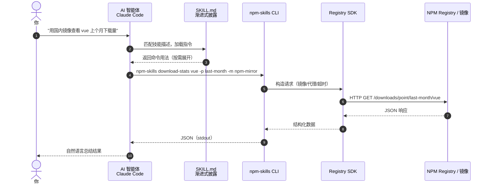
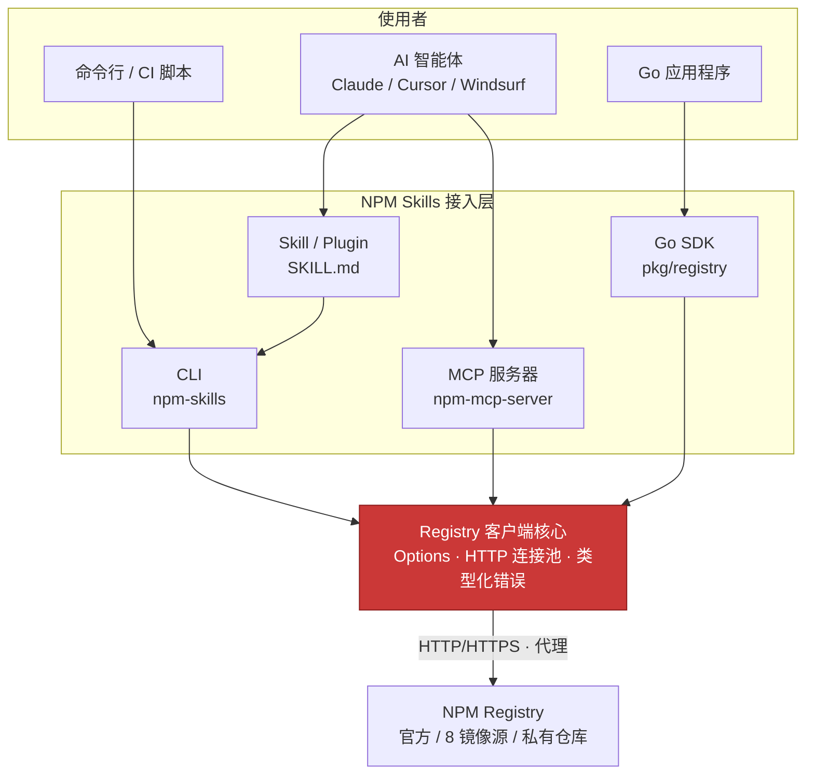
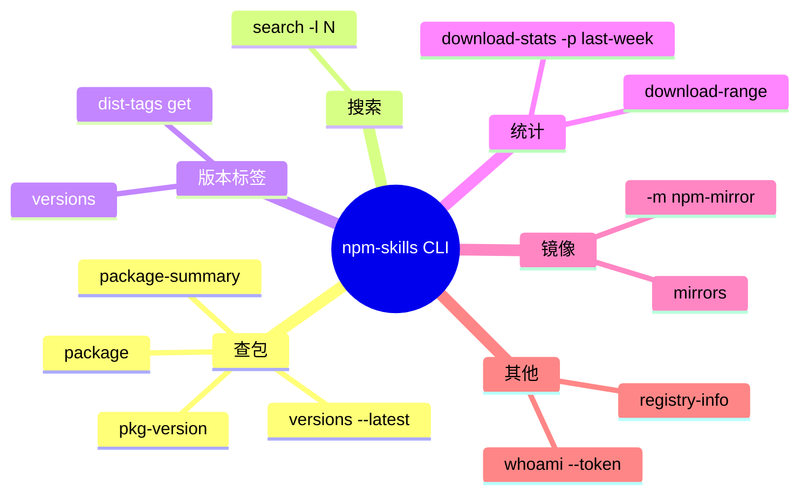
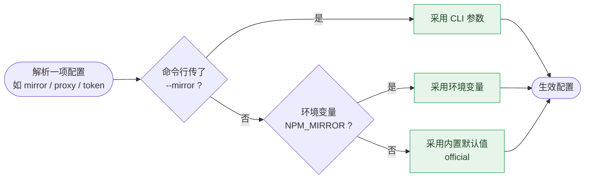

# 快速开始

## 一分钟安装为 Claude Code 插件

```bash
# 1. 添加 marketplace
claude plugin marketplace add scagogogo/npm-skills

# 2. 安装插件
claude plugin install npm@npm-skills
```

安装后直接用自然语言提问，AI 智能体会自动调用 NPM Skills：

> *"查找 axios 包的信息"*
> *"下载 react 的 tarball"*
> *"用国内镜像查看 vue 上个月下载量"*

从自然语言到 NPM Registry 的完整调用链路如下：



## 四种接入方式

四种入口共享同一套 Registry SDK 核心，最终统一走向 NPM Registry 或镜像源：



| 方式 | 适用场景 | 入口 |
|------|---------|------|
| **Skill / Plugin** | AI 智能体自动调用 | `claude plugin install npm@npm-skills` |
| **CLI 工具** | 命令行 / 脚本 | `npm-skills <command>` |
| **Go SDK** | Go 程序集成 | `import "github.com/scagogogo/npm-skills/pkg/registry"` |
| **MCP 服务器** | MCP 兼容客户端 | `npm-mcp-server` |

## CLI 速查（90% 场景）

26 个命令按功能域划分，90% 场景只需记住这几类：



```bash
npm-skills package-summary react            # 轻量包信息（推荐）
npm-skills search "http client" -l 10       # 搜索包
npm-skills versions react --latest          # 最新版本
npm-skills dist-tags get react              # dist-tags
npm-skills download-stats react -p last-month  # 下载统计
npm-skills mirrors                          # 镜像源列表
npm-skills package react -m npm-mirror      # 国内镜像
```

## 镜像与代理

```bash
# 国内镜像（无需代理）
npm-skills package react -m npm-mirror

# HTTP 代理
npm-skills package react --proxy http://127.0.0.1:7890

# 私有仓库
npm-skills package my-lib --registry https://npm.my-company.com -t npm_xxxxx

# 环境变量（推荐写入 shell 配置）
export NPM_MIRROR=npm-mirror
export NPM_PROXY=http://127.0.0.1:7890
export NPM_TOKEN=npm_xxxxx
```

当同一项配置被多处指定时，遵循「命令行参数 > 环境变量 > 默认值」的优先级：



## 下一步

- [CLI 命令手册](/cli) — 完整 26 个命令
- [Go SDK](/api/registry) — 程序化访问
- [MCP 服务器](/mcp-server) — 接入 AI 工具链
