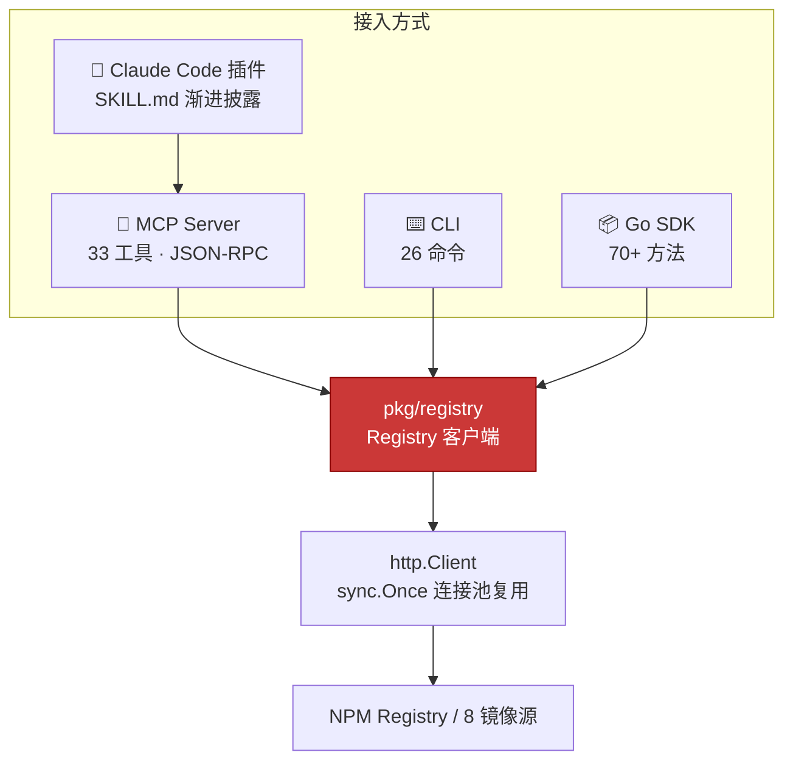

## 四种使用方式，一套核心

NPM Skills 把同一份 Registry 能力暴露为四种入口，按你的场景任选其一——底层共享同一个经过连接池优化的 Go 客户端：



## 30 秒上手

::: code-group

```bash [CLI]
# 查询包信息
npm-skills info react

# 搜索并按下载量排序
npm-skills search "web framework" --size 10

# 通过淘宝镜像下载 tarball（国内免代理）
npm-skills download lodash 4.17.21 ./ --registry https://registry.npmmirror.com
```

```go [Go SDK]
package main

import (
    "context"
    "fmt"

    "github.com/scagogogo/npm-skills/pkg/registry"
)

func main() {
    client := registry.NewRegistry()
    pkg, err := client.GetPackageInformation(context.Background(), "react")
    if err != nil {
        panic(err)
    }
    fmt.Println("最新版本:", pkg.DistTags["latest"])
}
```

:::

准备好深入了？前往 [快速开始](/getting-started) 了解四种接入方式的完整配置，或直接查阅 [API 文档](/api/) 与 [CLI 命令手册](/cli)。
