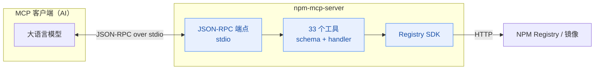
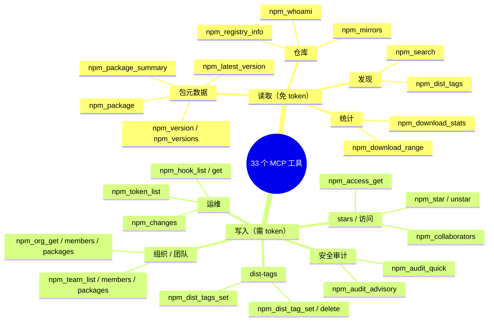

# MCP 服务器

NPM Skills 提供一个 MCP (Model Context Protocol) 服务器，将 NPM Registry 操作暴露为 33 个工具，供任意 MCP 兼容的 AI 客户端调用 —— Claude Code、Cursor、Windsurf 等。

## 架构

MCP 客户端与服务器之间通过 JSON-RPC（stdio 传输）通信；服务器把每个工具调用翻译成对 Registry SDK 的方法调用：



一次工具调用的完整时序（以查询包摘要为例）：


## 安装

```bash
# 从源码构建（同时构建 CLI 与 MCP 服务器）
bash scripts/install.sh

# 或 go install
go install github.com/scagogogo/npm-skills/cmd/mcp-server@latest
```

## 配置

### Claude Code

```json
{
  "mcpServers": {
    "npm-registry": {
      "command": "npm-mcp-server",
      "args": ["--mirror", "npm-mirror"]
    }
  }
}
```

### Cursor / 通用 MCP 客户端

```json
{
  "mcpServers": {
    "npm-registry": {
      "command": "npm-mcp-server",
      "args": ["--token", "npm_xxxxx", "--proxy", "http://127.0.0.1:7890"]
    }
  }
}
```

## 启动参数

| 参数 | 默认 | 说明 |
|------|------|------|
| `--mirror` | `official` | 镜像源名 |
| `--registry` | | 自定义注册表 URL |
| `--token` | | 认证 token（env: `NPM_TOKEN`） |
| `--proxy` | | HTTP 代理（env: `NPM_PROXY`） |
| `--timeout` | `120` | 超时秒数 |

## 工具清单（33 个）

33 个工具按领域可归为读取与写入两大类、若干子域。写入类需要有效 token：



### 读取工具

| 工具 | 说明 |
|------|------|
| `npm_registry_info` | 仓库状态与统计 |
| `npm_mirrors` | 镜像源列表 |
| `npm_package` | 完整包元数据（大） |
| `npm_package_summary` | 轻量包元数据（推荐） |
| `npm_search` | 搜索包（分页、加权） |
| `npm_version` | 特定版本元数据 |
| `npm_versions` | 所有版本号 |
| `npm_latest_version` | 最新版本号 |
| `npm_dist_tags` | dist-tags |
| `npm_download_stats` | 区间下载量 |
| `npm_download_range` | 每日下载趋势 |
| `npm_whoami` | 认证状态 |

### 写入工具（需要 token）

| 工具 | 说明 |
|------|------|
| `npm_dist_tag_set` | 设置 dist-tag |
| `npm_dist_tag_delete` | 删除 dist-tag |
| `npm_dist_tags_set` | 批量设置 dist-tags |
| `npm_star` | star 包 |
| `npm_unstar` | unstar 包 |
| `npm_stargazers` | 包的 stargazers |
| `npm_starred_by_user` | 用户 star 的包 |
| `npm_access_get` | 包访问设置 |
| `npm_collaborators` | 包协作者 |
| `npm_token_list` | API token 列表 |
| `npm_audit_quick` | 快速安全审计 |
| `npm_audit_advisory` | 按 ID 查询安全公告 |
| `npm_hook_list` | webhook 列表 |
| `npm_hook_get` | webhook 详情 |
| `npm_org_get` | 组织信息 |
| `npm_org_members` | 组织成员 |
| `npm_org_packages` | 组织包 |
| `npm_team_list` | 团队列表 |
| `npm_team_members` | 团队成员 |
| `npm_team_packages` | 团队包 |
| `npm_changes` | 仓库变更 feed |
