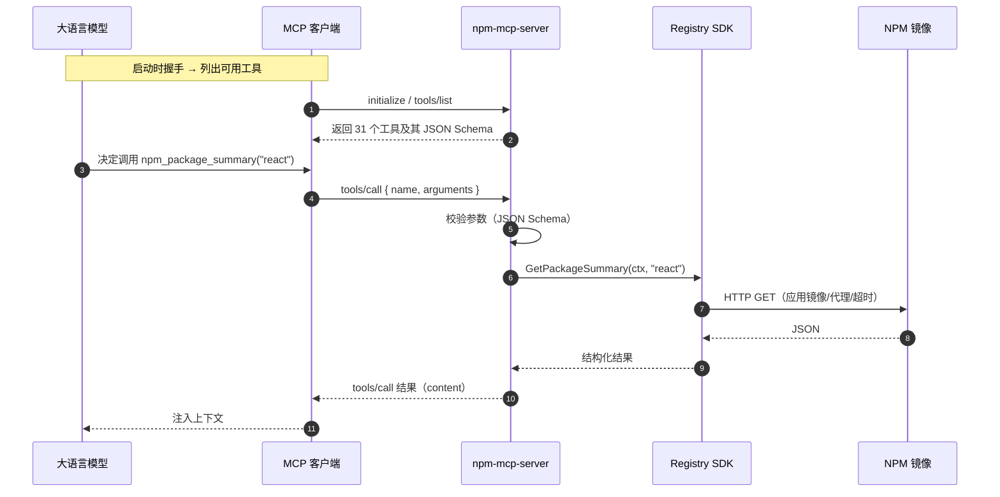
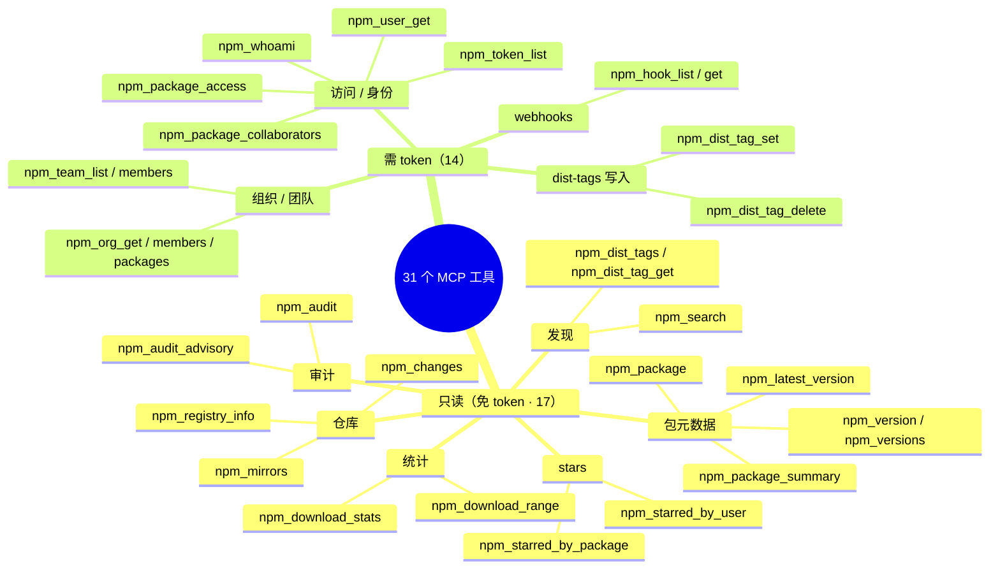

# MCP 服务器

NPM Skills 提供一个 MCP (Model Context Protocol) 服务器，将 NPM Registry 操作暴露为 31 个工具，供任意 MCP 兼容的 AI 客户端调用 —— Claude Code、Cursor、Windsurf 等。

## 架构

MCP 客户端与服务器之间通过 JSON-RPC（stdio 传输）通信；服务器把每个工具调用翻译成对 Registry SDK 的方法调用：


一次工具调用的完整时序（以查询包摘要为例）：



## 安装

```bash
# 从源码构建（同时构建 CLI 与 MCP 服务器）
bash scripts/install.sh

# 或 go install
go install github.com/scagogogo/npm-skills/cmd/mcp-server@latest
```

## 配置

### Claude Code

```json
{
  "mcpServers": {
    "npm-registry": {
      "command": "npm-mcp-server",
      "args": ["--mirror", "npm-mirror"]
    }
  }
}
```

### Cursor / 通用 MCP 客户端

```json
{
  "mcpServers": {
    "npm-registry": {
      "command": "npm-mcp-server",
      "args": ["--token", "npm_xxxxx", "--proxy", "http://127.0.0.1:7890"]
    }
  }
}
```

## 启动参数

| 参数 | 默认 | 说明 |
|------|------|------|
| `--mirror` | `official` | 镜像源名 |
| `--registry` | | 自定义注册表 URL |
| `--token` | | 认证 token（env: `NPM_TOKEN`） |
| `--proxy` | | HTTP 代理（env: `NPM_PROXY`） |
| `--timeout` | `120` | 超时秒数 |

## 工具清单（31 个）

31 个工具按是否需要 token 分为两类：17 个只读工具无需认证，14 个需要在服务端配置有效 token（`--token` 或 `NPM_TOKEN`）：



### 只读工具（无需 token）

| 工具 | 说明 |
|------|------|
| `npm_registry_info` | 注册表状态与统计（包总数、磁盘占用等） |
| `npm_mirrors` | 列出所有镜像源及其 URL、地区、说明 |
| `npm_package` | 完整包元数据（可能很大，10MB+；建议优先用 summary） |
| `npm_package_summary` | 轻量包元数据（名称、描述、dist-tags、版本列表，推荐） |
| `npm_search` | 按关键字搜索包（分页、评分加权） |
| `npm_version` | 特定版本的元数据（依赖、脚本、分发信息） |
| `npm_versions` | 所有已发布版本号（升序） |
| `npm_latest_version` | 最新版本号（仅查 dist-tags，轻量快速） |
| `npm_dist_tags` | 全部 dist-tags（latest / next / beta 等） |
| `npm_dist_tag_get` | 单个 dist-tag 指向的版本号 |
| `npm_download_stats` | 区间下载总量（始终查询 api.npmjs.org） |
| `npm_download_range` | 每日下载趋势数组（始终查询 api.npmjs.org） |
| `npm_audit` | 快速安全审计（提交「包名→版本」映射，返回按严重度的漏洞计数） |
| `npm_audit_advisory` | 按 ID 查询单条安全公告 |
| `npm_starred_by_package` | star 了指定包的用户列表 |
| `npm_starred_by_user` | 指定用户 star 的包列表 |
| `npm_changes` | 注册表变更 feed（用于镜像 / 增量同步） |

### 需要 token 的工具

| 工具 | 说明 |
|------|------|
| `npm_dist_tag_set` | 设置 / 更新 dist-tag 指向某版本 |
| `npm_dist_tag_delete` | 删除 dist-tag（删除 `latest` 有风险） |
| `npm_package_access` | 包的访问 / 权限设置 |
| `npm_package_collaborators` | 包协作者列表 |
| `npm_user_get` | 用户资料信息 |
| `npm_whoami` | 当前认证状态（返回用户名） |
| `npm_token_list` | 当前用户的 API token 列表 |
| `npm_org_get` | 组织详情 |
| `npm_org_members` | 组织成员 |
| `npm_org_packages` | 组织拥有的包 |
| `npm_team_list` | 组织内团队列表 |
| `npm_team_members` | 团队成员 |
| `npm_hook_list` | 当前用户的 webhook 列表 |
| `npm_hook_get` | 单个 webhook 详情 |

## 下一步

- 阅读 [快速开始](/getting-started) 完成安装与配置
- 查阅 [CLI 命令手册](/cli) 了解等价的命令行用法
- 浏览 [API 文档](/api/) 了解底层 SDK 方法
